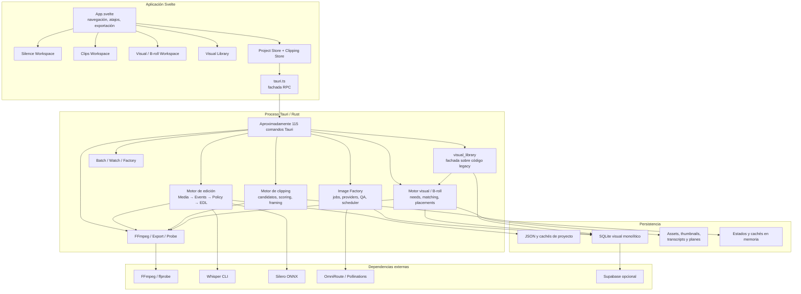
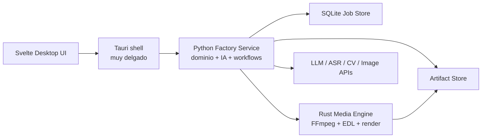

# Informe CTO — Auditoría arquitectónica de VigilCut

**Fecha:** 29 de julio de 2026  
**Proyecto:** VigilCut  
**Objetivo:** determinar la mejor arquitectura de largo plazo para convertir VigilCut en una fábrica interna de producción de contenido.

## Resumen ejecutivo

VigilCut no está mal construido. Está construido alrededor del producto equivocado.

La arquitectura actual corresponde a un editor de video inteligente centrado en detectar silencios, generar cortes, crear clips verticales, buscar o generar recursos visuales y renderizar con FFmpeg.

La nueva visión requiere una fábrica de contenido que transforme una idea en múltiples productos audiovisuales trazables, reanudables y reproducibles.

Actualmente no existe un modelo canónico de:

- Proyecto de contenido.
- Idea.
- Versión de guion.
- Escena.
- Necesidad visual.
- Artefacto.
- Trabajo durable.
- Dependencias entre trabajos.
- Render horizontal.
- Familia de shorts derivados.
- Linaje entre entradas y resultados.

El sistema tiene buenos subsistemas de procesamiento multimedia, pero están unidos como funcionalidades de una aplicación, no como etapas de una fábrica.

### Veredicto breve

La decisión recomendada es la **opción C: construir una arquitectura nueva dentro del mismo repositorio**, migrando por etapas.

- No continuar extendiendo la arquitectura actual.
- No hacer un rewrite total.
- No mantener Rust como lenguaje dominante de toda la plataforma.
- Mantener Rust como motor multimedia y ejecutor de FFmpeg.
- Usar Python para orquestación, IA, visión y automatización.
- Mantener Svelte/Tauri como interfaz de escritorio y panel de control.

Estimaciones globales:

- Código directamente reutilizable: **40–50%**.
- Conceptos y algoritmos reutilizables: **55–65%**.
- Subsistema visual que necesita reestructuración profunda: **60–75%**.
- Migración realista: **500–800 horas**.
- Primer valor sobre la arquitectura nueva: **6–8 semanas**.
- Migración sustancial: **12–18 semanas de ingeniería**.

---

## 1. Arquitectura actual



### Responsabilidades reales

1. **Interfaz Svelte:** navegación, estado de proyecto, selección de medios, análisis, reproducción, exportación y progreso.
2. **Capa de comandos Tauri:** API RPC extensa y fragmentada con aproximadamente 115 comandos.
3. **Motores especializados:** edición, clipping, composición visual, generación de imágenes y exportación.
4. **Persistencia local:** SQLite, JSON, sistema de archivos y cachés en memoria.
5. **Integraciones:** FFmpeg, Whisper, Silero, proveedores de imágenes y Supabase opcional.

---

## 2. Fortalezas

### Motor multimedia

La cadena conceptual siguiente es correcta para un motor de postproducción:

```text
Media → Features → Events → Policy → Edit Operations → EDL → Render
```

Elementos especialmente valiosos:

- EDL como representación de edición.
- Mapeo entre tiempo original y tiempo de salida.
- Validación de archivos.
- Manejo seguro de rutas temporales.
- Separación parcial entre detección y política.
- FFmpeg como ejecutor externo.
- Pruebas alrededor de exportación y transformaciones multimedia.

Este código no debe eliminarse. Debe convertirse en un subsistema, en vez de representar toda la arquitectura de VigilCut.

### Aplicación local

Tauri y Svelte son una elección razonable para una herramienta interna:

- Bajo consumo de recursos.
- Buena experiencia de interfaz.
- Acceso al sistema de archivos.
- Distribución sencilla.
- Sin infraestructura cloud innecesaria.

### Biblioteca visual

Existen componentes valiosos de ingesta, metadatos, miniaturas, deduplicación, conceptos visuales, control de costes, revisión de candidatos y adaptadores de proveedores.

La idea de una biblioteca visual independiente es correcta. Su implementación todavía no lo es.

### Procesamiento vertical

El sistema tiene una base importante para candidatos de clips, scoring, deduplicación, framing, conversión horizontal–vertical y render de shorts.

---

## 3. Debilidades

### Dominio principal equivocado

El proyecto todavía considera que su entidad central es un video abierto en el editor. La entidad central debería ser un `ContentProject`:

```text
Idea
  → ScriptVersion
    → ScenePlan
      → AssetRequirements
        → BuildPlan
          → HorizontalArtifact
            → ShortCandidates
              → VerticalArtifacts[]
```

Mientras este modelo no exista, cada etapa nueva se agregará como otro workspace, comando, caché o tabla.

### Monolito por funcionalidades

El problema no es tener un monolito. Para esta herramienta, un monolito modular sería ideal. El problema es que los límites de responsabilidad actuales no son reales.

### Capa RPC excesiva

La cantidad de comandos Tauri indica que la UI conoce demasiado sobre la implementación del backend. La interfaz debería invocar casos de uso completos:

```text
CreateContentProject
GenerateScriptVersion
ApproveScript
ResolveVisualRequirements
BuildHorizontalVideo
GenerateShortCandidates
RenderApprovedShorts
```

### Persistencia fragmentada

Conviven SQLite, JSON, archivos, cachés en memoria, estados de workers y sincronización opcional. No existe una fuente canónica para el estado completo de una producción.

### Biblioteca visual independiente solo nominalmente

El módulo `visual_library` es una capa relativamente pequeña sobre la implementación anterior. La propiedad real de la base de datos, generación, matching, supervisión, QA y proveedores permanece en `pipeline::visual`.

### Esquema SQLite gestionado en ejecución

Los `CREATE TABLE IF NOT EXISTS` y `ALTER TABLE` en tiempo de ejecución deben reemplazarse por:

- Migraciones versionadas.
- Propiedad clara de tablas.
- Repositorios.
- Transacciones por caso de uso.
- Recuperación explícita.

### Workers dentro del proceso de escritorio

La interfaz y los trabajos residentes comparten proceso:

```text
Cerrar la UI ≈ detener la fábrica
```

La UI debe poder cerrarse sin detener los trabajos.

### Fuentes temporales de verdad duplicadas

Existen segmentos, rangos conservados, EDL, TimeMap, spans de clipping, placements visuales y planes de render parcialmente independientes. Esto puede crear diferencias entre preview, análisis y exportación.

---

## 4. Responsabilidades mezcladas

### `pipeline::visual`

Mezcla biblioteca, generación, proveedores, necesidades visuales, matching, B-roll, persistencia, scheduler, QA, costes y render. Es prácticamente una segunda aplicación dentro de VigilCut.

### `App.svelte`

Mezcla enrutamiento, ciclo de vida, archivos, atajos, exportación, progreso y coordinación entre workspaces.

### `projectStore`

Mezcla modelo persistente, estado de UI, reproducción, análisis, configuración, segmentos, exportación y coordinación de comandos.

### Comandos Rust

Mezclan contratos, validación, lógica de aplicación, datos, workers y transformación de modelos.

### Base visual

Mezcla assets, conceptos, solicitudes, jobs, candidatos, QA, proveedores, costes, sincronización y métricas diarias.

---

## 5. Módulos que deberían existir

### Dominio

```text
domain/
  content_project
  idea
  script
  scene
  visual_requirement
  asset
  artifact
  production_recipe
  render_plan
  short_plan
  review
  cost_policy
```

### Aplicación

```text
application/
  project_service
  script_service
  library_service
  builder_service
  short_service
  workflow_orchestrator
  review_service
```

### Infraestructura

```text
infrastructure/
  sqlite_repositories
  filesystem_artifact_store
  ffmpeg_executor
  media_engine_client
  ai_providers
  generation_providers
  transcription_providers
  migrations
```

### Workers

```text
workers/
  transcription
  semantic_analysis
  image_generation
  visual_matching
  horizontal_render
  short_generation
  vertical_render
```

### Contratos compartidos

```text
contracts/
  commands
  events
  jobs
  artifacts
  errors
  progress
```

Los contratos deberían generar o validar automáticamente tipos para TypeScript, Python y Rust.

---

## 6. Reutilización realista

| Área | Reutilización | Evaluación |
|---|---:|---|
| Shell Tauri/Svelte | 70–85% | KEEP/MODIFY |
| Componentes visuales genéricos | 55–70% | MODIFY |
| Workspaces actuales | 25–40% | REWRITE |
| Player y controles temporales | 65–80% | KEEP |
| Store principal | 15–25% | REWRITE |
| Fachada `tauri.ts` | 15–25% | REWRITE |
| Events / Policy / EDL / TimeMap | 75–85% | KEEP |
| Segmentos como modelo canónico | 10–20% | REMOVE |
| FFmpeg / probe / safe paths | 80–90% | KEEP |
| Exportación horizontal | 75–85% | MODIFY |
| Clipping y scoring | 60–75% | MODIFY |
| Framing y export vertical | 70–85% | KEEP |
| Detección y transcripción | 45–60% | MODIFY |
| Biblioteca: ingesta/dedupe/thumbs | 60–75% | KEEP/MODIFY |
| Matching visual | 30–50% | MODIFY |
| Image Factory | 25–40% | REWRITE |
| Scheduler visual diario | 15–30% | REMOVE/REWRITE |
| `visual_library` actual | 30–45% | REWRITE |
| Batch/watch | 35–50% | REWRITE |
| Comandos Tauri | 10–20% | REWRITE |
| CLI | 25–40% | MODIFY |
| Datos existentes | 65–80% | KEEP/MIGRATE |
| Esquema y acceso SQLite | 15–30% | REWRITE |
| Supabase sync | 0–15% | REMOVE |
| Pruebas multimedia | 55–70% | KEEP |
| Pruebas de UI | <10% | Prácticamente inexistentes |

### Estimación global

- Reutilización directa de código: **40–50%**.
- Reutilización de conocimiento y algoritmos: **55–65%**.
- Reutilización del motor multimedia: **75–85%**.
- Reutilización de la arquitectura general: **20–30%**.

---

## 7. Clasificación de módulos importantes

| Módulo | Decisión | Motivo |
|---|---|---|
| Tauri desktop shell | KEEP | Buena plataforma local |
| Svelte | KEEP | Productividad y UX adecuadas |
| `App.svelte` | REWRITE | Demasiadas responsabilidades |
| `projectStore` | REWRITE | Modelo monolítico centrado en video |
| `clippingStore` | MODIFY | Puede ser estado de revisión de shorts |
| `tauri.ts` | REWRITE | RPC demasiado granular |
| Commands Rust | REWRITE | Sustituir por casos de uso coherentes |
| Media probe | KEEP | Infraestructura necesaria |
| Safe paths | KEEP | Reduce fallos y corrupción |
| FFmpeg sidecar | KEEP | Frontera tecnológica correcta |
| Export engine | MODIFY | Convertir en ejecutor de `RenderPlan` |
| Events | KEEP | Modelo útil para análisis multimedia |
| Policy engine | KEEP | Separa detección y decisión |
| EDL | KEEP | Excelente representación de edición |
| TimeMap | KEEP | Esencial para trazabilidad |
| `Segment[]` canónico | REMOVE | Duplica EDL |
| Silence analysis | MODIFY | Convertir en detector del media engine |
| Whisper integration | MODIFY | Colocar detrás de una interfaz ASR |
| Silero integration | MODIFY | Mantener como adaptador intercambiable |
| Clipping candidates | MODIFY | Integrar con Script/Scene/Artifact |
| Framing | KEEP | Algoritmos reutilizables |
| Vertical export | KEEP/MODIFY | Ejecutar desde planes persistentes |
| Visual matching | REWRITE | Separar dominio, embeddings y proveedores |
| B-roll planning | REWRITE | Operar sobre escenas y requisitos visuales |
| Visual Library | REWRITE | Convertir en dominio propietario real |
| Asset processing | KEEP | Ingesta, hashing y miniaturas son útiles |
| Generation worker | REWRITE | Usar el job engine común |
| Provider adapters | MODIFY | Mantener detrás de contratos estables |
| QA visual | MODIFY | Convertir en política de revisión genérica |
| Daily scheduler | REMOVE | Compite con el orquestador común |
| Batch/watch | REWRITE | Sustituir por jobs durables |
| Datos SQLite | KEEP/MIGRATE | Los datos valen; la capa de acceso no |
| Runtime schema updates | REMOVE | Usar migraciones versionadas |
| Supabase sync | REMOVE | Complejidad sin valor demostrado |
| CLI | MODIFY | Cliente del nuevo orquestador |
| Story contracts | MODIFY | Semilla útil, dominio incompleto |

---

## 8. Evaluación de Rust

### Como lenguaje de toda la aplicación: no

El centro de gravedad futuro será LLMs, prompts, embeddings, transcripción, visión, clasificación, experimentación e integración con proveedores.

Python tiene una ventaja sustancial en ecosistema, acceso a modelos, visión computacional, experimentación, procesamiento de datos y velocidad de integración.

Implementar todo en Rust es posible, pero no es económicamente racional para una herramienta interna.

### Como motor multimedia: sí

Rust sigue siendo adecuado para:

- Ejecución segura de FFmpeg.
- Manejo de archivos.
- Procesos largos.
- Concurrencia.
- Validación de artefactos.
- EDL y TimeMap.
- Transformaciones deterministas.
- Render y exportación.

### Arquitectura lingüística recomendada



La comunicación Python–Rust debe hacerse mediante trabajos completos, no llamadas pequeñas ni IPC por frame.

```json
{
  "job_type": "render_horizontal",
  "input_artifacts": ["..."],
  "render_plan": {},
  "output": {}
}
```

---

## 9. Coste, riesgo y beneficio de la migración

| Fase | Duración estimada |
|---|---:|
| Contratos y modelo objetivo | 1–2 semanas |
| Extraer media engine Rust | 2–3 semanas |
| Jobs durables y catálogo de artefactos | 2–4 semanas |
| Servicio Python y orquestación | 3–5 semanas |
| Migrar Visual Library | 3–5 semanas |
| Introducir Script/Scene/Builder | 3–6 semanas |
| Adaptar horizontal y shorts | 2–4 semanas |
| Reestructurar UI | 3–5 semanas |
| Compatibilidad, pruebas y limpieza | 2–4 semanas |

Hay trabajo que puede solaparse. La estimación total es:

- **12–18 semanas de ingeniería.**
- **500–800 horas.**
- **4–6 meses calendario** trabajando a tiempo parcial.
- Primer flujo útil: **6–8 semanas**.

### Riesgo

**6/10 — medio-alto.**

Riesgos principales:

- Migración incorrecta de datos visuales.
- Divergencia entre sistema antiguo y nuevo.
- Crear una capa Python excesivamente genérica.
- Mantener dos orquestadores demasiado tiempo.
- Intentar migrar todo antes de entregar valor.
- Introducir microservicios innecesarios.

### Beneficio esperado

**9/10 — alto.**

- Jobs reanudables.
- UI desacoplada de la ejecución.
- Trazabilidad de resultados.
- Sustitución sencilla de proveedores.
- Automatización del pipeline completo.
- Mayor velocidad de desarrollo AI.
- Menos fuentes de verdad.
- Procesamiento por lotes real.
- Múltiples formatos desde una producción.

La mejora esperada es de **2–4 veces en velocidad de desarrollo** para IA y automatización después de completar la base.

---

## 10. Opciones de migración

| Opción | Coste inicial | Riesgo futuro | Resultado |
|---|---:|---:|---|
| A. Continuar arquitectura actual | Bajo | Muy alto | No recomendada |
| B. Refactor pesado en Rust | Medio-alto | Alto | Mantiene fricción AI |
| C. Nueva arquitectura en el mismo repo | Alto controlado | Medio | **Recomendada** |
| D. Rewrite completo | Muy alto | Muy alto | Destruye valor útil |

### A. Continuar

Es la peor decisión a largo plazo. Cada etapa nueva aumentará comandos, estados, stores, tablas y dependencias cruzadas.

### B. Refactor pesado

Mejoraría límites, pero no corrige completamente la fricción para IA ni la ausencia de un orquestador durable.

### C. Nueva arquitectura dentro del repositorio

Permite mantener la aplicación funcionando, extraer motores útiles, migrar flujo por flujo, comparar resultados y retirar el sistema anterior gradualmente.

```text
Nuevo Content Project
    ↓
Nueva etapa implementada
    ↓
Adaptador temporal hacia motores antiguos
    ↓
Motor antiguo extraído o reemplazado
    ↓
Eliminar adaptador
```

### D. Rewrite total

No está justificado. FFmpeg, EDL, TimeMap, clipping, framing y procesamiento de assets tienen valor suficiente para conservarlos.

---

## 11. Arquitectura elegida si invirtiera mi propio dinero

Elegiría un monolito modular local con:

- Orquestador Python durable.
- Ejecutor multimedia Rust.
- Interfaz Svelte/Tauri delgada.
- SQLite con migraciones como base transaccional local.
- Sistema de archivos como almacén de artefactos.
- Contratos tipados y versionados.

No construiría microservicios cloud, Kubernetes ni sincronización remota sin una necesidad demostrada.

No permitiría que el proceso de escritorio sea dueño de los jobs.

No intentaría construir un editor manual generalista.

Construiría una fábrica orientada a excepciones:

1. El sistema produce automáticamente.
2. El propietario revisa decisiones de baja confianza.
3. Las aprobaciones alimentan políticas futuras.
4. Los resultados se guardan como artefactos reproducibles.
5. Un proyecto genera horizontal y múltiples shorts.
6. Cada trabajo puede reanudarse sin repetir todo el pipeline.

### Modelo central

```text
ContentProject
├── IdeaSpec
├── ScriptVersions[]
├── ApprovedScript
├── ScenePlan[]
├── VisualRequirements[]
├── Assets[]
├── ProductionRecipe
├── HorizontalArtifact
├── ShortCandidates[]
├── VerticalArtifacts[]
└── ReviewDecisions[]
```

Cada artefacto debe almacenar:

- ID.
- Tipo.
- Ubicación.
- Hash.
- Inputs.
- Parámetros.
- Modelo o proveedor.
- Coste.
- Fecha.
- Job creador.
- Estado de validación.

### Principio principal

> La UI no debe ejecutar la fábrica. Debe observarla y gobernarla.

---

## 12. Puntuaciones actuales

| Dimensión | Puntuación | Evaluación |
|---|---:|---|
| Arquitectura | 5/10 | Buenos motores, composición equivocada |
| Mantenibilidad | 4/10 | Acoplamiento alto y propiedad difusa |
| Escalabilidad | 4/10 | Escala medios, no workflows |
| Extensibilidad | 4/10 | Cada funcionalidad invade varias capas |
| Deuda técnica | 7.5/10 | Alta; mayor puntuación significa más deuda |
| Velocidad de desarrollo | 4/10 | Baja para IA y evolución de producto |
| Integración futura de IA | 4/10 | Posible, pero costosa actualmente |
| Calidad del motor multimedia | 7.5/10 | Parte más sólida del sistema |
| Alineación con la nueva visión | 3/10 | Sigue representando el producto anterior |
| General | 4.5/10 | Recuperable mediante cambio estructural |

---

## Riesgos si no se actúa

1. La biblioteca visual se convertirá en otro monolito.
2. Idea y Script se agregarán como pantallas sin integrarse al dominio.
3. Horizontal y shorts terminarán con modelos incompatibles.
4. Los procesos largos seguirán dependiendo de la UI.
5. Cada proveedor AI añadirá lógica especial.
6. La recuperación de trabajos será incompleta.
7. El estado quedará repartido entre base de datos, archivos y memoria.
8. Reproducir resultados antiguos será difícil.
9. La velocidad de desarrollo caerá con cada etapa.
10. El eventual rewrite será más caro que la migración actual.

---

## Recomendaciones

### Inmediatas

1. Congelar nuevas funcionalidades dentro de `pipeline::visual`.
2. Definir `ContentProject`, `Artifact`, `Job` y `ProductionRecipe`.
3. Introducir migraciones SQLite versionadas.
4. Crear un catálogo único de artefactos.
5. Extraer FFmpeg, EDL y TimeMap como `media-engine`.
6. Hacer que los jobs sobrevivan al cierre de la interfaz.
7. Definir contratos generados entre Svelte, Python y Rust.

### Posteriores

1. Migrar Visual Library como dominio real.
2. Incorporar Idea y Script sobre el modelo nuevo.
3. Construir Scene Plan y Visual Requirements.
4. Convertir B-roll en consumidor de la biblioteca.
5. Derivar horizontal y shorts del mismo proyecto.
6. Sustituir batch/watch y schedulers específicos por el job engine.
7. Eliminar segmentos, estados y comandos legacy al terminar la migración.

---

## Veredicto final

VigilCut no debe reescribirse desde cero, pero tampoco debe continuar creciendo sobre su arquitectura actual.

El activo principal no es la aplicación completa, sino sus motores:

- FFmpeg.
- EDL.
- TimeMap.
- Detección.
- Clipping.
- Framing.
- Procesamiento de assets.

Esos motores deben sobrevivir. La arquitectura que los rodea debe ser reemplazada.

La decisión técnicamente correcta es:

> Construir una nueva fábrica de contenido dentro del mismo repositorio, migrar mediante adaptadores y retirar progresivamente el editor monolítico anterior.

Rust debe permanecer en un rol reducido y especializado. Python debe convertirse en el cerebro de producción e IA. Svelte/Tauri debe permanecer como interfaz y panel de control.

---

## Nivel de confianza

- Diagnóstico arquitectónico: **88%**.
- Elección de arquitectura objetivo: **85%**.
- Recomendación híbrida Rust/Python: **82%**.
- Estimación de reutilización: **75%**.
- Estimación temporal: **65–75%**.

---

## Incógnitas

- Volumen real de videos procesados semanalmente.
- Tamaño actual de la biblioteca visual.
- Necesidad de operar en varias máquinas.
- Necesidad real de Supabase.
- Necesidad de ejecutar trabajos con la UI cerrada.
- Modelos locales frente a APIs.
- Hardware y GPU disponibles.
- Participación humana prevista en Idea y Script.
- Calidad actual de los shorts.
- Etapa que consume más tiempo humano.
- Funciones legacy realmente utilizadas.
- Necesidad de edición manual cuadro a cuadro.
- Requisitos de reproducción determinista de proyectos antiguos.
