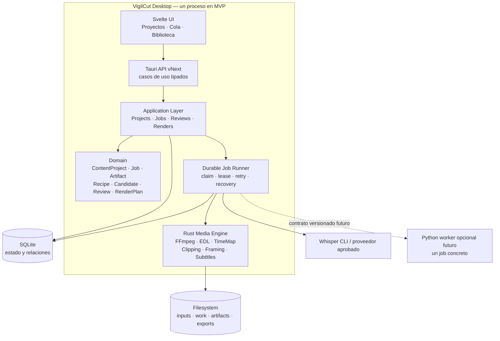

# 1. Executive Summary

VigilCut debe evolucionar desde un conjunto de herramientas de edición hacia una fábrica local de entregables audiovisuales. El cambio no requiere reescribir la aplicación ni introducir de inmediato un backend Python. Requiere cambiar la unidad central del producto: de “video abierto y estado de interfaz” a “proyecto de producción con trabajos, decisiones y artefactos persistentes”.

**[HECHO]** El repositorio ya contiene motores utilizables para análisis, EDL, mapeo temporal, clipping, framing, composición visual y exportación con FFmpeg. Las implementaciones principales están en `src-tauri/src/pipeline/`, `src-tauri/src/pipeline/clipping/`, `src-tauri/src/pipeline/visual/`, `src-tauri/src/ffmpeg/sidecar.rs`, `src-tauri/src/models/edl.rs` y `src-tauri/src/pipeline/time_map.rs`.

**[HECHO]** La aplicación ejecutable sigue organizada alrededor de cuatro workspaces —silencio, clips, visuales y biblioteca— declarados en `src/App.svelte`. El modelo `Project` de `src-tauri/src/models/project.rs` representa un único `media_path`, segmentos y un preset. No representa la producción completa de un video horizontal y sus derivados.

**[HECHO]** La confiabilidad es desigual. El export horizontal usa rutas temporales, validación y finalización atómica en `src-tauri/src/pipeline/export.rs` y `src-tauri/src/pipeline/safe_paths.rs`. Los jobs visuales tienen persistencia, idempotencia y leases en `src-tauri/src/pipeline/visual/schema.rs` y `generation/worker.rs`. En cambio, clipping y batch dependen de mapas en memoria en `src-tauri/src/commands/clipping.rs` y `src-tauri/src/state.rs`.

**[INFERENCIA]** El activo principal de VigilCut no es su arquitectura general, sino sus motores multimedia y parte de su UX de revisión. El mayor bloqueo no es Rust: es la ausencia de un modelo durable y común para Project, Job, Artifact, ReviewDecision y RenderPlan.

**[RECOMENDACIÓN]** La arquitectura aprobada es un **monolito modular local Rust-first**, conservando Svelte, Tauri, SQLite y FFmpeg. Durante el MVP habrá un solo proceso. Los jobs se persistirán antes de ejecutarse y se recuperarán al volver a abrir la aplicación. No se construirá todavía un daemon, HTTP local, microservicios ni backend Python obligatorio.

**[RECOMENDACIÓN]** El primer producto será **video de cliente → un Short vertical terminado**: ingestión, transcripción, candidatos, revisión mínima, framing, subtítulos, render atómico, validación y manifiesto. Es la ruta más corta a un servicio cobrable y reutiliza el pipeline más avanzado del repositorio.

**[RECOMENDACIÓN]** Después se ampliará el mismo flujo a lotes de Shorts. Solo entonces se construirá faceless horizontal con Idea, Script, Scene, VisualRequirement y Biblioteca Visual, reutilizando los mismos jobs y artifacts. Python podrá incorporarse únicamente como worker aislado para una tarea AI concreta que demuestre una mejora medible.

La decisión final del comité es inequívoca:

> Productizar y endurecer clipping primero; construir la fábrica sobre jobs y artifacts persistentes; mantener Rust como backend principal; posponer Python y la fábrica faceless completa.

---

# 2. Hallazgos

## Producto

**[HECHO]** `package.json` y `src-tauri/Cargo.toml` describen VigilCut como una factory, pero la interacción real de `src/App.svelte` continúa orientada a abrir un video y elegir una herramienta.

**[HECHO]** `src-tauri/src/models/story_contracts.rs` contiene `StoryProject`, `StoryScene` y requisitos de escena, pero el propio módulo declara que no es un Story Builder completo. No existe un flujo integrado Idea → guion → escenas → render horizontal.

**[INFERENCIA]** Existen dos productos superpuestos: el editor inteligente histórico y una fábrica visual en construcción. Seguir agregando workspaces no crea una fábrica; aumenta las rutas de estado sin una producción canónica.

**[RECOMENDACIÓN]** El usuario real es únicamente el propietario-operador. Los clientes suministran fuentes y reciben entregables; no necesitan cuentas ni acceso a la aplicación.

**[RECOMENDACIÓN]** Los tres flujos de negocio se ordenan así:

1. Video de cliente → Short terminado.
2. Video largo → varios Shorts revisados.
3. Idea/guion/audio → video horizontal faceless → Shorts derivados.

## UX

**[HECHO]** `src/App.svelte` coordina navegación, inicialización, atajos, selección de archivo, progreso y exportación. `src/lib/stores/project.svelte.ts` combina proyecto, media, segmentos, reproducción, análisis, errores y exportación.

**[HECHO]** Ya existen componentes aprovechables de revisión y reproducción: `ClippingPanel.svelte`, `ShortPlayer.svelte`, `VerticalClipPreview.svelte`, `Timeline.svelte`, `ExceptionQueue.svelte` y `ReviewInbox.svelte`.

**[HECHO]** La documentación de UX no es completamente consistente. `docs/UNIFIED_VISUALS_UX_SPEC.md`, `docs/LIBRARY_CONTROL_CENTER_SPEC.md` y la navegación actual difieren en la posición de Biblioteca.

**[INFERENCIA]** La UX debe dejar de preguntar “¿qué herramienta quieres abrir?” y pasar a mostrar “¿qué producción requiere tu decisión?”.

**[RECOMENDACIÓN]** La navegación vNext será `Proyectos | Cola | Biblioteca`. Dentro de un proyecto: `Resumen | Candidatos | Revisión | Exportaciones`. Las herramientas legacy permanecerán accesibles durante la migración, pero no dirigirán el producto nuevo.

**[RECOMENDACIÓN]** El timeline se limita a inicio/fin del Short, waveform, framing y cues de subtítulos. No se construirá un editor multipista generalista.

## Frontend

**[HECHO]** `src/lib/utils/tauri.ts` contiene una fachada RPC cercana a 900 líneas y varias operaciones visuales devuelven `unknown`.

**[HECHO]** `src/lib/types/index.ts` replica manualmente modelos Rust y mantiene simultáneamente segmentos, EDL y otros estados temporales.

**[HECHO]** No se encontraron archivos de tests frontend `*.test.*` o `*.spec.*` bajo `src/`.

**[INFERENCIA]** Reemplazar Svelte no resolvería el problema. La deuda está en la separación de estado y contratos, no en el framework.

**[RECOMENDACIÓN]** `App.svelte` se reducirá gradualmente a shell. El estado se separará en UI efímera, snapshot de proyecto, jobs y borrador de revisión. La API vNext será pequeña, tipada y basada en casos de uso; la fachada legacy no se reescribe de una vez.

## Backend y dominio

**[HECHO]** `src-tauri/src/lib.rs` registra alrededor de 115 comandos en un único proceso Tauri y arranca el supervisor visual durante `setup`.

**[HECHO]** `src-tauri/src/state.rs` contiene `projects` y `batch_jobs` como `Mutex<HashMap<...>>`. Los proyectos además se escriben a JSON; batch no tiene persistencia durable equivalente.

**[HECHO]** `src-tauri/src/commands/analyze.rs` guarda AnalysisRun en JSON y puede recuperarlo. `src-tauri/src/commands/clipping.rs` mantiene ClippingRun solo en memoria, incluyendo estados, spans y framing modificados.

**[HECHO]** `src-tauri/src/pipeline/visual/schema.rs` muestra que el repositorio ya conoce claves de idempotencia, leases, cancelación y recuperación de jobs visuales.

**[INFERENCIA]** No hace falta introducir un orquestador externo para obtener durabilidad. El patrón mínimo existe en Rust y SQLite; debe generalizarse solo lo necesario para el primer flujo.

**[RECOMENDACIÓN]** Los modelos canónicos inmediatos serán:

- `ContentProject`: raíz de producción y política de privacidad.
- `ProductionRecipe`: snapshot versionado de decisiones repetibles.
- `Job`: estado durable, inputs, intentos, lease, error y outputs.
- `Artifact`: archivo inmutable, hash, probe, validación y linaje.
- `ShortCandidate`: propuesta persistida con score, span y framing.
- `ReviewDecision`: decisión humana append-only.
- `RenderPlan`: especificación inmutable del render.

Idea, ScriptVersion, Scene y VisualRequirement se incorporarán cuando comience el flujo faceless; no necesitan tablas vacías en el MVP.

## Multimedia

**[HECHO]** `src-tauri/src/models/edl.rs` representa rangos conservados y contiene pruebas de bordes. `src-tauri/src/pipeline/time_map.rs` convierte entre timeline fuente y salida y prueba round-trips y cortes.

**[HECHO]** `src-tauri/src/pipeline/export.rs` prefiere EDL, pero todavía admite segmentos y rangos explícitos como fallbacks.

**[HECHO]** `src-tauri/src/ffmpeg/sidecar.rs` resuelve binarios, ejecuta ffprobe/FFmpeg, oculta ventanas en Windows y soporta cancelación cooperativa.

**[HECHO]** `src-tauri/src/pipeline/clipping/` implementa generación, scoring, preselección, deduplicación, títulos, framing y export vertical.

**[HECHO]** `src-tauri/src/pipeline/clipping/export_clips.rs` exporta 9:16, pero no usa la cadena completa de temp, validación y finalización atómica del export horizontal y no quema subtítulos.

**[HECHO]** `src-tauri/src/commands/subtitles.rs` importa SRT/VTT, pero su comando Whisper es un stub. Existe una integración Whisper real separada en `src-tauri/src/pipeline/detectors/whisper_cli.rs`.

**[RECOMENDACIÓN]** Conservar FFmpeg, EDL, TimeMap, safe paths, export horizontal, generación/scoring de clips, deduplicación y framing. Reemplazar parcialmente el export vertical para consumir RenderPlan, subtítulos y validación atómica. Unificar las rutas de transcripción.

## IA y Biblioteca Visual

**[HECHO]** `src-tauri/src/pipeline/semantic.rs` realiza extracción determinista de keywords, frases y conceptos sin LLM.

**[HECHO]** El matching visual en `src-tauri/src/pipeline/visual/intelligent_match.rs` y `match_rank.rs` usa términos, contextos, exclusiones, formato, licencia y reutilización.

**[HECHO]** La base visual contiene assets, conceptos, relaciones, necesidades, jobs, candidatos, QA, proveedor, costes y sync en `src-tauri/src/pipeline/visual/schema.rs`.

**[HECHO]** `src-tauri/src/visual_library/infrastructure/legacy_adapter.rs` todavía reexporta la propiedad SQLite de `pipeline::visual::library`; la independencia de Visual Library no está completada.

**[HECHO]** La biblioteca ya registra SHA-256, perceptual hash, licencia, procedencia, QA y uso. Supabase está desactivado por defecto y protegido por configuración en `src-tauri/src/visual_library/infrastructure/storage/supabase_storage.rs`.

**[INFERENCIA]** IA debe mejorar selección semántica, ASR, visión o generación; no debe gobernar paths, estados, reintentos, validación, cuotas ni geometría determinista.

**[RECOMENDACIÓN]** Biblioteca y generación visual no forman parte del primer slice. Se preservan sus datos y se estabilizan después de validar Shorts. Supabase no recibirá inversión actual.

## QA y operación

**[HECHO]** Existen suites Rust unitarias, smoke y e2e en `src-tauri/tests/` para pipeline, factory, clipping y visuales, además de scripts de test, fmt y clippy en `package.json`.

**[HECHO]** No existe una prueba integral de video de cliente → Short subtitulado → interrupción → reinicio → artifact válido.

**[INFERENCIA]** El producto puede producir archivos, pero el repositorio todavía no demuestra que pueda garantizar una entrega recuperable de cliente.

**[RECOMENDACIÓN]** Todo output final debe producirse en temporal, validarse con ffprobe, finalizarse atómicamente y registrarse como Artifact. Los eventos de progreso no serán fuente de verdad; SQLite conservará el último estado.

---

# 3. Qué funciona

| Área | Evidencia | Decisión | Justificación |
|---|---|---|---|
| Svelte 5/Vite | `src/`, `package.json` | Conservar | La UI ya existe; migrarla no acelera producción |
| Tauri | `src-tauri/src/lib.rs` | Conservar | Shell local apropiada y acceso nativo |
| Rust multimedia | `pipeline/`, `ffmpeg/` | Conservar | Código probado y cercano al primer producto |
| FFmpeg/ffprobe | `ffmpeg/sidecar.rs` | Conservar | Motor correcto para render determinista |
| Safe paths y atomicidad | `pipeline/safe_paths.rs` | Conservar y reutilizar | Evita archivos finales parciales |
| Events/Policy/EDL | `models/edl.rs`, `pipeline/policy.rs` | Conservar | Separa detección de decisión y render |
| TimeMap | `pipeline/time_map.rs` | Conservar | Une tiempos fuente y salida |
| Clipping | `pipeline/clipping/` | Conservar y adaptar | Base directa para el MVP vendible |
| Framing | `clipping/framing.rs` | Conservar y adaptar | Ya genera geometría 9:16 |
| Player/revisión | componentes Svelte de clips | Conservar y adaptar | Reduce el coste de UX del slice |
| Visual layout | `pipeline/visual/layout.rs` | Conservar para Fase 3 | Contrato compartido preview/FFmpeg |
| Metadata de Biblioteca | modelos y schema visual | Conservar datos | Hash, licencia, QA y uso tienen valor |
| Job pattern visual | schema/worker visual | Reutilizar patrón | Ya demuestra idempotencia y recovery parcial |
| Tests Rust | unit, smoke, e2e | Conservar y ampliar | Protegen motores críticos |

**[RECOMENDACIÓN]** “Conservar” no significa congelar interfaces actuales. Significa mantener algoritmos y comportamientos valiosos detrás de contratos vNext.

---

# 4. Qué no funciona

| Limitación | Evidencia | Consecuencia | Decisión |
|---|---|---|---|
| Proyecto centrado en un video | `models/project.rs` | No modela derivados ni linaje | Reemplazar gradualmente por ContentProject |
| Navegación por herramientas | `App.svelte` | Oculta el estado de producción | Añadir navegación por proyectos/cola |
| Store global excesivo | `project.svelte.ts` | Mezcla UI, dominio y ejecución | Separar stores |
| RPC fragmentado | `lib.rs`, `tauri.ts` | UI conoce detalles internos | API vNext por casos de uso |
| Clipping en memoria | `commands/clipping.rs` | Pierde revisión al reiniciar | Persistir en SQLite |
| Batch en memoria | `state.rs`, `commands/batch.rs` | No es recuperable | Posponer y migrar al job común |
| Fuentes temporales duplicadas | EDL, segmentos, explicit ranges | Preview/export pueden divergir | RenderPlan/EDL canónicos |
| Export vertical incompleto | `clipping/export_clips.rs` | No es entrega final confiable | Temp, validate, atomic, subtitles |
| Transcripción duplicada | subtitle stub y Whisper real | Contratos incoherentes | Unificar adaptador ASR |
| Pipeline visual monolítico | `pipeline/visual/` | Mezcla biblioteca, generación y render | No extender; migrar después |
| Visual Library dependiente de legacy | `legacy_adapter.rs` | Independencia nominal | Migración incremental posterior |
| Schema aditivo en runtime | `visual/schema.rs` | Evolución difícil de auditar | Migraciones numeradas |
| Falta tests frontend | `src/` | Estados críticos sin protección | Añadir tests a vNext |
| Supabase sin necesidad demostrada | módulo de sync opcional | Complejidad no rentable | Posponer indefinidamente |

**[RECOMENDACIÓN]** No se hará una limpieza masiva antes del MVP. Cada pieza legacy se retira únicamente después de que su reemplazo pase aceptación.

---

# 5. Alternativas consideradas

## Alternativa A — Continuar la arquitectura actual en Rust

### Pros

- Máxima reutilización inmediata.
- Sin nuevo runtime ni packaging.
- Menor riesgo de migración.

### Contras

- Mantiene stores, comandos y estados fragmentados.
- Agregar Idea/Script como otro workspace empeoraría el producto.
- No resuelve jobs ni artifacts canónicos.

### Decisión

**Rechazada.** Se mantiene Rust, pero no la arquitectura actual.

## Alternativa B — Migrar el backend principal a Python

### Pros

- Ecosistema superior para modelos, visión, embeddings y experimentación.
- Integración rápida con proveedores AI.

### Contras

- Obliga a reimplementar o envolver el backend antes del primer entregable.
- Reduce reutilización de clipping, jobs y lógica Rust.
- Añade instalación, lifecycle, IPC y diagnóstico.
- No corrige por sí sola el modelo de producto.

### Decisión

**Rechazada.** No produce valor antes que endurecer el flujo existente.

## Alternativa C — Híbrido Rust + Python obligatorio desde el MVP

### Pros

- Buen límite teórico entre multimedia e IA.
- Mayor libertad para modelos futuros.

### Contras

- Tres stacks activos: TypeScript, Rust y Python.
- Introduce contratos de proceso y fallos distribuidos antes de necesitarlos.
- Complica soporte para una sola persona.

### Decisión

**Rechazada para la arquitectura base.** Python solo podrá entrar posteriormente como worker aislado de un job concreto, no como segundo backend general.

## Alternativa D — Rewrite completo

### Pros

- Modelo limpio desde cero.

### Contras

- Descarta motores y pruebas valiosos.
- Retrasa indefinidamente el primer resultado vendible.
- Alto riesgo de reconstruir los mismos fallos.

### Decisión

**Rechazada.**

## Alternativa aprobada — Nueva capa vNext dentro del mismo repositorio

### Pros

- Entrega incremental.
- Reutiliza multimedia y UX existentes.
- Permite retirar legacy por feature.
- Mantiene operación simple.
- Deja una frontera futura para workers AI sin pagarlos hoy.

### Contras

- Habrá convivencia temporal entre modelos legacy y vNext.
- Requiere disciplina para no crear dos fuentes de verdad.

### Decisión

**Aprobada:** monolito modular Rust-first, SQLite durable, Svelte/Tauri y FFmpeg, implementado dentro del repositorio actual mediante reemplazo progresivo.

---

# 6. Arquitectura aprobada

## Responsabilidades

### Interfaz

- Presentar proyectos, próxima acción, cola, revisión y artifacts.
- Mantener solo estado efímero de interacción.
- Consultar snapshots; usar eventos únicamente para refresco rápido.
- Nunca construir argumentos FFmpeg ni decidir transiciones de job.

### Application Layer

- Ejecutar casos de uso completos.
- Validar permisos, estado y precondiciones.
- Coordinar transacciones, jobs y artifacts.
- No contener detalles de Svelte ni FFmpeg.

### Dominio

- Modelos y reglas puras.
- Transiciones permitidas.
- Invariantes de ReviewDecision y RenderPlan.
- Sin dependencias de Tauri, SQLite o procesos.

### Job Runner

- Persistir antes de ejecutar.
- Claim transaccional con lease.
- Cancelación cooperativa.
- Reintentos explícitos e idempotencia.
- Marcar como `interrupted` trabajos cuyo lease expiró.
- En MVP, recuperar al reabrir; no continuar con la UI cerrada.

### Media Engine

- Probe, transcripción, EDL, TimeMap, clipping, framing y render.
- Aceptar planes completos y devolver artifacts/resultados.
- Escribir en temporal, validar y finalizar atómicamente.

### Persistencia

**[RECOMENDACIÓN]** SQLite es fuente de verdad de metadata, estado, decisiones y linaje. El sistema de archivos es fuente de bytes. Las migraciones serán numeradas, transaccionales, respaldables y probadas.

Tablas iniciales:

- `content_projects`
- `production_recipes`
- `jobs`
- `artifacts`
- `artifact_parents`
- `short_candidates`
- `review_decisions`
- `render_plans`

No se crean todavía tablas de Idea, Scene o VisualRequirement.

## Contratos

Los contratos v1 serán `ContentProjectSnapshot`, `ProductionRecipe`, `JobSnapshot`, `ArtifactManifest`, `ShortCandidate`, `ReviewDecision`, `VerticalRenderPlan`, `JobProgress` y `ApplicationError`.

Cada contrato especificará versión, unidades, enums y compatibilidad. TypeScript no debe volver a copiar respuestas ambiguas como `unknown`.

## Tecnología

- **Rust:** backend principal y multimedia.
- **Python:** no forma parte de MVP ni Fase 2; solo worker futuro aprobado para una capacidad AI medida.
- **Svelte:** se mantiene.
- **Tauri:** se mantiene como shell y transporte.
- **SQLite:** se mantiene y se convierte en fuente durable común.
- **FFmpeg:** se mantiene.
- **Supabase:** se pospone sin fecha; no pertenece a la ruta de producto actual.

---

# 7. Roadmap

## Fase 0 — Recuperabilidad mínima

### Construir

- Contratos v1 y estados de job.
- Migraciones y backup.
- ContentProject, ProductionRecipe, Job y Artifact mínimos.
- Persistencia de ClippingRun, candidatos y decisiones.
- Detección de jobs interrumpidos al iniciar.

### Valor entregado

Un proyecto de clipping, sus candidatos y decisiones sobreviven al reinicio. VigilCut deja de ser una sesión desechable.

### Criterio de salida

- Crear, cerrar y reabrir un proyecto sin perder selección, span ni framing.
- Simular interrupción y obtener estado `interrupted` recuperable.

## MVP — Video de cliente → Short terminado

### Construir

- Ingesta y hash de fuente.
- Transcripción unificada.
- Ranking y deduplicación existentes.
- Revisión mínima: aprobar/rechazar, span, framing y texto.
- Preset cerrado de subtítulos.
- VerticalRenderPlan.
- Export 1080×1920 temporal, validado y atómico.
- Manifiesto y artifact final.
- Vista Proyectos, Revisión y Cola.
- E2E de cierre/reinicio/reintento.

### Valor entregado

Un Short cobrable producido sin depender de otra aplicación para la edición normal.

### Criterio de salida

- 10 Shorts reales a partir de al menos 3 fuentes autorizadas.
- 100% de outputs pasan ffprobe y especificación.
- Cero outputs finales parciales en pruebas de interrupción.
- Tiempo activo mediano del operador igual o menor a 15 minutos por Short, excluyendo espera de cómputo.

## Fase 2 — Video largo → lote de Shorts

### Construir

- Aprobación por lote y revisión por excepciones.
- Recipes por canal/cliente.
- Jobs encadenados y artifacts múltiples.
- Métricas de aceptación, tiempo y retrabajo.
- Reranking AI únicamente si supera al baseline en un dataset real.

### Valor entregado

Varios Shorts terminados por fuente con baja intervención manual.

### Criterio de salida

- Top 5 contiene al menos 70% de clips finalmente aceptados.
- Reintentos no duplican artifacts.
- El operador puede completar un lote desde una sola cola de revisión.

## Fase 3 — Fábrica faceless horizontal

### Construir

- Idea y ScriptVersion.
- Scenes y VisualRequirements.
- Modelo estable de Theme, Concept, Representation y Asset.
- Buscar Biblioteca antes de generar.
- Video Builder basado en RenderPlan.
- HorizontalArtifact.
- Shorts derivados usando el pipeline ya validado.

### Valor entregado

Un proyecto faceless produce horizontal y verticales con linaje compartido.

### Criterio de salida

- Un guion aprobado produce un horizontal validado.
- Cada escena explica qué asset utilizó y por qué.
- Cada Short deriva de un artifact horizontal o fuente identificable.

---

# 8. Riesgos

| Prioridad | Riesgo | Impacto | Mitigación |
|---:|---|---|---|
| 1 | Calidad de Short insuficiente para clientes | Producto no vendible | Fixtures de referencia, revisión humana y aceptación real antes de batch |
| 2 | Pérdida de estado durante cierre o fallo | Trabajo y confianza perdidos | SQLite, lease, transacciones y pruebas de interrupción |
| 3 | Archivo final corrupto o incompleto | Entrega fallida | Temp, ffprobe, finalización atómica y manifest |
| 4 | Exposición de material de cliente | Daño contractual/privacidad | Local-only por defecto y aprobación por upload |
| 5 | Desfase preview/render | Retrabajo manual | Un RenderPlan y geometría compartida |
| 6 | Scope creep hacia editor generalista | Meses sin valor | Timeline mínimo y prohibiciones explícitas |
| 7 | Dos arquitecturas permanentes | Mantenimiento creciente | Retiro legacy por feature y criterio de salida |
| 8 | Scorer produce candidatos débiles | Mucha revisión | Medir baseline; AI solo si mejora top-N |
| 9 | Rust limita un modelo futuro | Bloqueo puntual | Worker por job con contrato estable, no migración total |
| 10 | Migración visual destruye datos | Pérdida de biblioteca | Posponer, respaldar y migrar aditivamente |
| 11 | Dependencia de proveedor/coste | Pipeline bloqueado o caro | Adaptadores, límites locales y coste explícito |
| 12 | Falta de tests frontend | Regresiones de workflow | Tests de stores, estados y caso crítico vNext |

---

# 9. Preguntas abiertas

Estas preguntas dependen del propietario; ninguna cambia la arquitectura aprobada, pero sí configura el MVP:

1. **[INCÓGNITA]** ¿Duración objetivo principal: 15–30, 30–60 o hasta 90 segundos?
2. **[INCÓGNITA]** ¿Subtítulos palabra por palabra, por frase o ambos como presets?
3. **[INCÓGNITA]** ¿Qué tres estilos visuales representan las primeras entregas?
4. **[INCÓGNITA]** ¿Los videos de cliente pueden enviarse a APIs externas o deben permanecer siempre locales?
5. **[INCÓGNITA]** ¿Cuál es la política prometida de retención y eliminación?
6. **[INCÓGNITA]** ¿Cuál es el tiempo máximo aceptable de producción por Short?
7. **[INCÓGNITA]** ¿Cuántos videos y Shorts semanales debe soportar la primera versión?
8. **[INCÓGNITA]** ¿Existen 10–20 Shorts de referencia y sus fuentes para medir calidad?
9. **[INCÓGNITA]** ¿La continuidad del render con UI cerrada es necesaria o basta recuperar al reabrir?

---

# 10. Decisión final

El comité aprueba una sola evolución:

> Construir VigilCut vNext dentro del repositorio actual como un monolito modular Rust-first, con Svelte/Tauri, SQLite durable y FFmpeg; entregar primero video de cliente → Short terminado; ampliar después a lotes y finalmente a faceless horizontal.

No se migra el backend principal a Python. No se implanta una arquitectura híbrida obligatoria. No se reescribe desde cero. No se amplía el editor manual. No se construyen microservicios, daemon ni cloud en el MVP.

La arquitectura de largo plazo no depende de introducir otro lenguaje. Depende de que Project, Job, Artifact, ReviewDecision y RenderPlan sean canónicos, persistentes y compartidos por todos los flujos.

Rust seguirá siendo el backend principal mientras cumpla el producto. Cuando una capacidad AI concreta requiera Python y demuestre una mejora medible, se implementará como worker aislado por job. Esa excepción no altera la propiedad del dominio ni de los datos.

Svelte, Tauri, SQLite y FFmpeg permanecen. Supabase queda fuera del roadmap activo. Visual Library se conserva, pero su migración no bloquea el primer ingreso.

---

# 11. Implementation Brief

## Objetivo de implementación

Entregar incrementalmente el flujo **video de cliente → un Short 1080×1920 subtitulado, validado, persistente y recuperable**, sin rediseñar de nuevo la arquitectura.

## Prioridades

1. Durabilidad de Project, Job y Artifact.
2. Persistencia de candidatos y decisiones.
3. Render vertical confiable.
4. Subtítulos utilizables.
5. UX de revisión mínima.
6. Prueba integral e indicadores de calidad.

## Orden de construcción

1. Definir contratos v1, estados e invariantes.
2. Diseñar migración SQLite no destructiva y backup.
3. Solicitar aprobación del esquema.
4. Implementar repositorios y tests de ContentProject, Job y Artifact.
5. Adaptar ClippingRun y ShortCandidate a persistencia.
6. Persistir ReviewDecision, span y framing.
7. Probar cierre/reinicio antes de cambiar la UI principal.
8. Definir VerticalRenderPlan v1.
9. Adaptar export vertical a temp, cancelación, validación y finalización atómica.
10. Unificar Whisper/transcript/subtitle cues.
11. Añadir un único preset de subtítulos aprobado.
12. Añadir API Tauri vNext tipada.
13. Construir Proyectos, Revisión y Cola en Svelte.
14. Crear E2E de interrupción, recuperación, reintento y artifact.
15. Ejecutar aceptación con fixtures.
16. Solicitar aprobación antes de usar material real o proveedores externos.

## Límites obligatorios

- No reescribir motores que pueden adaptarse.
- No mover todos los archivos para “limpiar” antes de entregar.
- No crear backend Python, HTTP local, microservicios ni daemon.
- No ampliar Image Factory, Daily Feed, Supabase o Story Builder durante el MVP.
- No construir timeline multipista, keyframes generales ni motion graphics arbitrario.
- No usar IA para estados, rutas, reintentos, validación o geometría determinista.
- No hacer de eventos de UI la fuente de verdad.
- No completar jobs sin artifact validado.
- No borrar legacy hasta que el reemplazo pase aceptación.

## Código que debe conservarse

- `src-tauri/src/ffmpeg/sidecar.rs`.
- `src-tauri/src/pipeline/safe_paths.rs`.
- `src-tauri/src/models/edl.rs`.
- `src-tauri/src/pipeline/time_map.rs`.
- Algoritmos de `src-tauri/src/pipeline/clipping/`.
- Integración real de `src-tauri/src/pipeline/detectors/whisper_cli.rs`.
- Player, preview vertical y timeline mínimo.
- Tests Rust existentes.
- Patrón de idempotencia/lease de jobs visuales.

## Código que debe reemplazarse o limitarse

- Cache de ClippingRun exclusivamente en memoria.
- Export vertical directo sin temp/validación/manifest.
- Stub Whisper duplicado en subtitles.
- Progreso global sin `job_id`.
- Estado de proyecto, jobs y reproducción dentro de un único store.
- Respuestas vNext como `unknown`.
- Segmentos como fuente de verdad cuando exista EDL o RenderPlan.

## Contratos iniciales

- `ContentProjectSnapshotV1`
- `ProductionRecipeV1`
- `JobSnapshotV1`
- `ArtifactManifestV1`
- `ShortCandidateV1`
- `ReviewDecisionV1`
- `VerticalRenderPlanV1`
- `JobProgressV1`
- `ApplicationErrorV1`

Cada contrato debe fijar versión, campos obligatorios, enums, unidades, timestamps y compatibilidad. Debe existir una única definición verificable entre Rust y TypeScript.

## Migraciones

- Numeradas y transaccionales.
- Probadas desde base vacía y desde schema actual.
- Backup antes de la primera migración vNext.
- Sin `DROP`, renames destructivos ni backfills ambiguos en MVP.
- Los errores no se ignoran.
- Un job interrumpido nunca se transforma en completed sin validar output.

## Pruebas obligatorias

- Transiciones válidas e inválidas de Job.
- Claim concurrente e idempotencia.
- Lease expirado → interrupted.
- Persistencia de candidato, span, framing y ReviewDecision.
- Input/output path safety.
- Cancelación y limpieza de temporales.
- Archivo corrupto no completa job.
- ffprobe de resolución, codecs, streams y duración.
- Subtítulos dentro de zona segura.
- Reintento no duplica artifact final.
- Reinicio reconstruye proyecto y próxima acción.
- E2E: input → transcript → candidate → review → render → restart → artifact.
- Tests frontend de estados vacío, running, waiting_review, interrupted, failed y completed.
- Suite legacy relevante permanece verde.

## Criterios de aceptación

- Un proyecto y sus decisiones sobreviven al reinicio.
- Un render interrumpido se puede reintentar.
- Ningún temporal aparece como entrega final.
- El MP4 final es 1080×1920, reproducible y contiene audio/subtítulos cuando corresponde.
- El manifest explica fuente, hashes, candidate, recipe, RenderPlan, job y versión del motor.
- La UI muestra próxima acción y error recuperable.
- No hay uploads externos sin aprobación registrada.
- Diez Shorts reales cumplen los criterios de Fase MVP.

## Detenciones y aprobación obligatoria

La implementación debe detenerse antes de:

1. Aplicar la primera migración vNext.
2. Elegir el mecanismo de contrato único Rust/TypeScript.
3. Fijar el primer preset visual de subtítulos.
4. Enviar video, audio, transcript o frames a un servicio externo.
5. Introducir Python, un modelo o una dependencia AI nueva.
6. Crear un proceso residente o ejecución con UI cerrada.
7. Modificar o retirar tablas y modelos legacy.
8. Usar material real de cliente.
9. Implementar borrado o retención automática.
10. Ampliar alcance a batch, Biblioteca, horizontal faceless o edición avanzada.

Cada paso posterior debe ser pequeño, reversible, probado y vinculado a un criterio de aceptación anterior.
