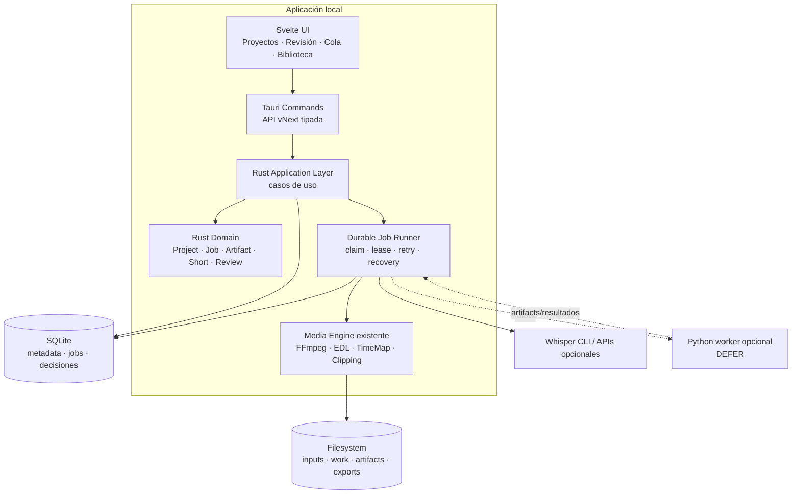

# VigilCut vNext — Decisión técnica y de producto

**Fecha de decisión:** 29 de julio de 2026

**Estado:** propuesta aprobada por el comité técnico y de producto, pendiente de las decisiones del propietario enumeradas en la sección 22.

**Pregunta central:** cuál es el camino más corto, seguro y mantenible para transformar VigilCut en una fábrica local funcional de videos faceless y Shorts operada por una sola persona.

## Convenciones de evidencia

- **[HECHO DEL REPOSITORIO]** Observación comprobada directamente en código o documentación actual.
- **[INFERENCIA]** Conclusión derivada de hechos observados.
- **[RECOMENDACIÓN]** Decisión propuesta para VigilCut vNext.
- **[INCÓGNITA]** Información que el repositorio no permite determinar.

---

## 1. Resumen ejecutivo

**[HECHO DEL REPOSITORIO]** VigilCut ya dispone de una cadena funcional para analizar videos, proponer clips, revisar candidatos, ajustar el encuadre y exportar MP4 verticales. Las piezas principales están en `src-tauri/src/pipeline/clipping/`, `src-tauri/src/commands/clipping.rs`, `src/lib/components/ClippingPanel.svelte` y `src/lib/components/ShortPlayer.svelte`.

**[HECHO DEL REPOSITORIO]** El export vertical actual recorta y escala a 9:16 mediante FFmpeg, pero no quema subtítulos, no usa el mismo cierre atómico y validación fuerte del export horizontal y conserva el `ClippingRun` solo en memoria. Véanse `src-tauri/src/pipeline/clipping/export_clips.rs`, `src-tauri/src/pipeline/safe_paths.rs` y `src-tauri/src/commands/clipping.rs`.

**[INFERENCIA]** El camino más corto hacia un resultado vendible no es comenzar con la fábrica faceless horizontal. Es convertir el flujo existente de clipping en un flujo confiable de **video de cliente → un Short terminado**. Ese slice valida calidad, revisión humana, subtítulos, framing, artefactos y recuperación sin construir primero Idea, Script, Visual Library y Video Builder.

**[RECOMENDACIÓN]** El primer producto de VigilCut vNext será una estación local de producción asistida de Shorts. Recibirá un video, propondrá candidatos, permitirá aprobar y corregir solo lo necesario, y entregará un Short vertical listo para enviar al cliente.

**[RECOMENDACIÓN]** Para el MVP se mantendrán Svelte, Tauri, Rust, SQLite y FFmpeg. No se introducirá Python como backend principal ni como servicio obligatorio. Python quedará permitido posteriormente como worker opcional para tareas AI concretas cuando exista evidencia de que las reglas, Whisper CLI o las APIs no alcanzan la calidad requerida.

**[RECOMENDACIÓN]** La recuperación del MVP será durable y simple: todo job se registra en SQLite antes de ejecutarse; un cierre interrumpido se detecta al volver a abrir la aplicación y se ofrece reintentar. Mantener trabajos ejecutándose con la UI cerrada se pospone hasta demostrar que aporta valor suficiente para justificar un proceso residente independiente.

**[RECOMENDACIÓN]** La visión completa continúa siendo:

```text
Idea → Guion → Escenas → Biblioteca Visual → Video horizontal
     → Candidatos de Shorts → Shorts verticales
```

El MVP no debe construir toda esa visión. Debe establecer los contratos mínimos —`ContentProject`, `Job`, `Artifact`, `RenderPlan` y `ReviewDecision`— que eviten volver a crear estados desechables.

---

## 2. Evidencias principales del repositorio

### Producto y aplicación

1. **[HECHO DEL REPOSITORIO]** `src/App.svelte` ofrece cuatro modos superiores: `silence`, `clips`, `visual` y `library`. La entidad implícita sigue siendo un video abierto, no una producción de contenido.
2. **[HECHO DEL REPOSITORIO]** `src-tauri/src/models/project.rs` define `Project` con `media_path`, `segments`, preset y modos `silence_cut`, `clip_select` y `full`. No representa un proyecto con múltiples entradas, trabajos y salidas.
3. **[HECHO DEL REPOSITORIO]** `src-tauri/src/models/story_contracts.rs` contiene `StoryProject`, `StoryScene` y requisitos visuales, pero el propio archivo declara que no es un Story Builder completo.
4. **[HECHO DEL REPOSITORIO]** `docs/UNIFIED_VISUALS_UX_SPEC.md`, `docs/LIBRARY_CONTROL_CENTER_SPEC.md` y la navegación real no coinciden completamente respecto de si Biblioteca es una vista interna o un modo superior independiente.
5. **[INFERENCIA]** La documentación describe varias direcciones históricas. El código ejecutable debe prevalecer como evidencia del estado actual y este documento debe prevalecer como decisión de vNext.

### Frontend

6. **[HECHO DEL REPOSITORIO]** `src/App.svelte` gestiona inicialización, FFmpeg, navegación, atajos, selección de archivos, exportación, listeners de progreso, toasts y coordinación de workspaces.
7. **[HECHO DEL REPOSITORIO]** `src/lib/stores/project.svelte.ts` supera las 800 líneas y combina proyecto, media, segmentos, análisis, progreso, errores, reproducción y exportación.
8. **[HECHO DEL REPOSITORIO]** `src/lib/utils/tauri.ts` se acerca a 900 líneas y replica una gran cantidad de comandos Tauri; varias respuestas visuales están tipadas como `unknown`.
9. **[HECHO DEL REPOSITORIO]** Los tipos de `src/lib/types/index.ts` reflejan manualmente modelos Rust y mantienen `Segment[]` junto a EDL.
10. **[HECHO DEL REPOSITORIO]** No se encontraron archivos de prueba frontend `*.test.*` o `*.spec.*` bajo `src/`.
11. **[INFERENCIA]** El frontend no necesita un rewrite visual completo para el MVP, pero sí separar estado de navegación, proyecto persistido, jobs y revisión.

### Backend y jobs

12. **[HECHO DEL REPOSITORIO]** `src-tauri/src/lib.rs` registra alrededor de 115 comandos en un solo proceso Tauri y arranca el supervisor visual durante `setup`.
13. **[HECHO DEL REPOSITORIO]** `src-tauri/src/state.rs` guarda proyectos y batch jobs en `Mutex<HashMap<...>>`; los proyectos también se escriben como `project.json`, mientras los batch jobs no tienen persistencia equivalente.
14. **[HECHO DEL REPOSITORIO]** `src-tauri/src/commands/analyze.rs` persiste AnalysisRun como JSON y puede recargarlo desde disco.
15. **[HECHO DEL REPOSITORIO]** `src-tauri/src/commands/clipping.rs` conserva `ClippingRun` únicamente en un `HashMap` en memoria; aprobaciones, spans y framing se pierden al reiniciar.
16. **[HECHO DEL REPOSITORIO]** Los jobs de generación visual sí usan SQLite, claves de idempotencia, leases, cancelación y recuperación de trabajos atascados en `src-tauri/src/pipeline/visual/schema.rs` y `src-tauri/src/pipeline/visual/generation/worker.rs`.
17. **[INFERENCIA]** No hace falta inventar un orquestador genérico desde cero. Debe extraerse el patrón durable mínimo ya probado por el worker visual y aplicarlo al vertical slice.

### Multimedia

18. **[HECHO DEL REPOSITORIO]** `src-tauri/src/models/edl.rs` implementa rangos conservados ordenados y pruebas de bordes; `src-tauri/src/pipeline/time_map.rs` convierte entre tiempo de fuente y salida y prueba cortes, límites y round-trips.
19. **[HECHO DEL REPOSITORIO]** `src-tauri/src/pipeline/export.rs` prefiere EDL, pero conserva fallbacks desde segmentos y rangos explícitos.
20. **[HECHO DEL REPOSITORIO]** El export horizontal usa archivo temporal, validación y finalización atómica mediante `src-tauri/src/pipeline/safe_paths.rs`.
21. **[HECHO DEL REPOSITORIO]** `src-tauri/src/ffmpeg/sidecar.rs` resuelve binarios empaquetados o del sistema, oculta consolas en Windows, controla procesos y valida resultados parciales.
22. **[HECHO DEL REPOSITORIO]** `src-tauri/src/pipeline/clipping/` contiene generación, preselección, scoring, deduplicación temporal/textual, títulos, framing y exportación vertical.
23. **[HECHO DEL REPOSITORIO]** `src-tauri/src/pipeline/visual/layout.rs` comparte geometría de preview y FFmpeg; `src-tauri/src/pipeline/visual/render.rs` valida y finaliza overlays de forma atómica.
24. **[HECHO DEL REPOSITORIO]** `src-tauri/src/commands/subtitles.rs` importa SRT/VTT, pero `generate_subtitles_whisper` es un stub. Existe una integración Whisper real separada en `src-tauri/src/pipeline/detectors/whisper_cli.rs`.
25. **[INFERENCIA]** La transcripción existe, pero la cadena “transcribir → editar cues → estilo → burn-in vertical” no está unificada.

### IA y Biblioteca Visual

26. **[HECHO DEL REPOSITORIO]** `src-tauri/src/pipeline/semantic.rs` extrae keywords, bigramas y conceptos mediante reglas deterministas, sin LLM.
27. **[HECHO DEL REPOSITORIO]** El matching visual usa términos, contextos, exclusiones, formato, licencia y uso; no se encontró un sistema de embeddings como fuente canónica en `src-tauri/src/pipeline/visual/intelligent_match.rs` y `match_rank.rs`.
28. **[HECHO DEL REPOSITORIO]** `src-tauri/src/pipeline/visual/schema.rs` contiene tablas para assets, themes, concepts, relaciones, needs, jobs, candidatos, QA, proveedores, costes y sincronización.
29. **[HECHO DEL REPOSITORIO]** `visual_library` declara dominio, aplicación e infraestructura, pero `src-tauri/src/visual_library/infrastructure/legacy_adapter.rs` sigue adaptando la implementación de `pipeline::visual`.
30. **[HECHO DEL REPOSITORIO]** Los assets tienen SHA-256, perceptual hash, procedencia, licencia, QA, uso y relaciones múltiples con conceptos.
31. **[HECHO DEL REPOSITORIO]** No existe una entidad explícita `Representation`; significados, contextos y exclusiones están repartidos entre `VisualConcept`, `MediaAsset`, `VisualNeed` y contratos de búsqueda.
32. **[HECHO DEL REPOSITORIO]** Supabase está desactivado por defecto y protegido por flags y validación de RLS en `src-tauri/src/visual_library/infrastructure/storage/supabase_storage.rs`.

### Pruebas y operación

33. **[HECHO DEL REPOSITORIO]** Existen unit tests Rust y suites `smoke_*` y `e2e_*` para análisis, exportación, clipping, visuales y biblioteca bajo `src-tauri/tests/`.
34. **[HECHO DEL REPOSITORIO]** Las pruebas verifican motores y algunos flujos con FFmpeg, pero no existe una prueba end-to-end del producto “video de cliente → Short con subtítulos → cierre/reinicio → recuperación”.
35. **[HECHO DEL REPOSITORIO]** El proyecto tiene scripts separados para unit, smoke, e2e, clippy y format en `package.json` y `scripts/test-all.ps1`.
36. **[INFERENCIA]** La base técnica es suficiente para un slice incremental, pero no para prometer producción de cliente recuperable sin añadir persistencia y pruebas de aceptación.

---

## 3. Producto y alcance aprobados

### Usuario real

**[RECOMENDACIÓN]** Existe un solo usuario primario: el propietario-operador de VigilCut. Los clientes entregan material y reciben archivos; no son usuarios de la aplicación.

### Producto principal

**[RECOMENDACIÓN]** VigilCut vNext será una **fábrica local asistida de entregables audiovisuales**, no un editor generalista ni un SaaS.

### Flujos de producto, en orden

1. **MVP:** video de cliente → un Short terminado.
2. **Fase 2:** video largo propio o de cliente → lote de Shorts revisados.
3. **Fase 3:** audio/guion → video horizontal faceless → Shorts derivados.

### Primer resultado vendible

**[RECOMENDACIÓN]** Un MP4 1080×1920 con tramo aprobado, encuadre vertical correcto, audio conservado, subtítulos quemados legibles y manifiesto de producción.

### Shorts propios frente a Shorts para clientes

| Aspecto | Shorts propios | Shorts para clientes |
|---|---|---|
| Riesgo de privacidad | Bajo/moderado | Alto; material confidencial por defecto |
| Libertad creativa | Alta | Condicionada por marca y encargo |
| Revisión | Se puede aceptar por lote | Aprobación explícita por entregable |
| Naming y carpetas | Por canal/campaña | Por cliente/proyecto/entrega |
| Retención | Según conveniencia | Política configurable y eliminación verificable |
| Estilo | Preset del canal | Recipe/preset versionado del cliente |
| Calidad mínima | Publicable | Contractualmente entregable |

**[RECOMENDACIÓN]** El MVP debe incluir `project_kind = client_short` y `client_label`, pero no CRM, facturación, portal de cliente ni multiusuario.

### Alcance mínimo

- Importar un video local.
- Crear un `ContentProject` persistente.
- Transcribir o reutilizar transcript.
- Proponer candidatos con el motor actual.
- Aprobar uno, ajustar inicio/fin y framing.
- Generar y permitir corregir subtítulos del tramo.
- Seleccionar un preset visual limitado.
- Renderizar de forma atómica.
- Validar el MP4.
- Reanudar o reintentar después de un cierre.
- Registrar artifact, recipe, decisiones y errores.

---

## 4. Primer vertical slice seleccionado

### Comparación ponderada

Escala 1–10. El total usa: tiempo 20%, calidad 20%, reducción manual 15%, confiabilidad 15%, mantenimiento 10%, evolución 10%, reutilización 5% y rendimiento 5%.

| Alternativa | Tiempo | Calidad | Menos trabajo | Confiabilidad | Mantenimiento | Evolución | Reutilización | Rendimiento | Total ponderado |
|---|---:|---:|---:|---:|---:|---:|---:|---:|---:|
| A. Audio + guion → horizontal faceless | 4 | 6 | 8 | 5 | 5 | 9 | 4 | 7 | **5.95** |
| B. Video largo → Shorts automáticos | 8 | 6 | 9 | 6 | 7 | 8 | 9 | 8 | **7.45** |
| C. Video de cliente → Short terminado | 9 | 9 | 7 | 8 | 8 | 8 | 9 | 8 | **8.35** |

**[INFERENCIA]** B parece más automatizado, pero exige confiar en selección masiva y calidad consistente antes de tener un bucle de revisión sólido. C reduce el alcance a un entregable, introduce el control de calidad correcto y reutiliza el mismo pipeline.

**[RECOMENDACIÓN]** Se selecciona **C. Video de cliente → Short terminado**.

### Entrada

- Archivo MP4/MOV/MKV/WebM local.
- Nombre de cliente y proyecto.
- Idioma.
- Recipe de Short: duración objetivo, resolución, estilo de subtítulos y zona segura.

### Etapas

1. Ingesta y probe.
2. Registro de artifact fuente con hash y metadatos.
3. Transcripción.
4. Generación, scoring y deduplicación de candidatos.
5. Selección automática de los mejores candidatos para revisión.
6. Revisión humana de un candidato.
7. Ajuste opcional de tramo y framing.
8. Generación/corrección de cues del tramo.
9. Construcción de `RenderPlan` inmutable.
10. Render vertical temporal.
11. Probe y validación.
12. Finalización atómica y registro de `VerticalArtifact`.

### Decisiones automáticas

- Probe y validación del input.
- Transcripción si no existe una compatible.
- Candidatos y ranking inicial.
- Deduplicación.
- Encuadre inicial center/manual existente.
- Partición de subtítulos por longitud y tiempo con reglas.
- Naming, ruta temporal, hash y validación del output.

### Decisiones humanas

- Aprobar o rechazar candidato.
- Ajustar comienzo y final si el corte rompe una idea.
- Corregir texto visible.
- Confirmar framing cuando el sujeto quede mal.
- Aprobar el render final.

### Código reutilizado

- `pipeline/clipping/generate.rs`, `score.rs`, `dedupe.rs`, `preselect.rs` y `titles.rs`.
- `pipeline/clipping/framing.rs`.
- `ffmpeg/sidecar.rs`.
- `pipeline/safe_paths.rs`.
- Parsing y transcript de `pipeline/transcript_engine.rs` y `detectors/whisper_cli.rs`.
- `ClippingPanel.svelte`, `ShortPlayer.svelte` y `VerticalClipPreview.svelte` como base de UX.
- Patrones de idempotencia/lease del worker visual, no su dominio visual.

### Código nuevo o reemplazado

- Persistencia SQLite de ContentProject, Artifact, Job, ShortCandidate, ReviewDecision y RenderPlan.
- Adaptador para persistir `ClippingRun` y sus modificaciones.
- Composición de subtítulos verticales y preset de estilo limitado.
- Export vertical con temp, validación, cancelación y finalización atómica.
- Vista de proyecto y cola/reanudación de jobs.
- Prueba e2e del slice completo.

### Criterios de aceptación del slice

1. Un video válido produce al menos un candidato o un estado explícito “sin candidatos”.
2. Una aprobación y modificación sobreviven al reinicio.
3. El output es 1080×1920, H.264/AAC, reproducible y con duración dentro de ±150 ms del plan.
4. Los subtítulos están dentro de la zona segura y no exceden el máximo configurado por línea.
5. Un cierre durante render no deja un artifact final corrupto.
6. Al reabrir, el job interrumpido aparece como recuperable y puede reintentarse.
7. Reintentar con los mismos inputs y recipe no crea artifacts finales duplicados inadvertidamente.
8. Input y output nunca son la misma ruta.
9. El manifiesto registra fuente, hash, candidate, recipe, render plan, timestamps y versión del motor.
10. El operador puede completar un Short sin abrir otra aplicación, salvo que decida realizar una edición avanzada fuera de alcance.

---

## 5. Experiencia de usuario objetivo

### Navegación del MVP

**[RECOMENDACIÓN]** Sustituir gradualmente la navegación por herramientas por navegación por producción:

```text
Proyectos | Cola | Biblioteca

Proyecto abierto:
Resumen → Candidatos → Revisión → Exportaciones
```

No eliminar los modos legacy durante el MVP; ocultarlos bajo “Herramientas anteriores” hasta migrar sus capacidades.

### Pantallas necesarias

1. **Proyectos:** recientes, cliente, estado y próxima acción.
2. **Nuevo proyecto:** fuente, tipo, idioma y recipe.
3. **Detalle de proyecto:** etapa actual, jobs, artifacts y errores.
4. **Candidatos:** ranking, transcript, duración y razón del score.
5. **Revisión de Short:** player, tramo, framing, cues y preset.
6. **Cola:** queued/running/waiting_review/failed/completed/interrupted.
7. **Biblioteca Visual:** se conserva independiente, pero no participa en el MVP.

### Revisión por excepciones

**[RECOMENDACIÓN]** El operador no debe editar todo. La UI debe enseñar únicamente:

- candidatos que necesitan aprobación;
- framing con baja confianza;
- cues con baja confianza o longitud excesiva;
- fallo de validación;
- conflicto de ruta/licencia/coste.

### Timeline y player

**[RECOMENDACIÓN]** Conservar un timeline mínimo de un solo clip con handles de inicio/fin, waveform opcional y cues. No construir pistas ilimitadas, keyframes, multicámara ni edición frame-perfect generalista.

**[RECOMENDACIÓN]** Mantener `ShortPlayer.svelte` y `VerticalClipPreview.svelte`, adaptándolos para leer un `ShortCandidateView` persistido y un `RenderPlan`, no directamente el store global.

### Automatización frente a aprobación

| Acción | Automática | Requiere aprobación |
|---|---:|---:|
| Probe, hash y metadata | Sí | No |
| Transcripción inicial | Sí | Solo si falla/confianza baja |
| Ranking de candidatos | Sí | Sí, selección final |
| Framing inicial | Sí | Solo excepción o antes del render final |
| División de subtítulos | Sí | Corrección de texto visible |
| Render de preview | Sí | No |
| Render final | Tras aprobación | Sí |
| Borrado de material de cliente | No | Siempre |

---

## 6. Arquitectura frontend

### `App.svelte` — MODIFY

**[HECHO DEL REPOSITORIO]** Actualmente coordina navegación, comandos globales y exportación.

**[RECOMENDACIÓN]** Mantenerlo como shell, pero mover los casos de uso a páginas/controladores de feature. Debe conservar solamente inicialización, navegación superior, errores globales y eventos de aplicación.

### Stores — REWRITE selectivo

**[RECOMENDACIÓN]** Crear stores separados por responsabilidad:

- `uiStore`: navegación, paneles, selección temporal y toasts.
- `projectStore`: snapshot canónico del ContentProject cargado.
- `jobStore`: jobs, progreso real, reintento y cancelación.
- `reviewStore`: borrador local de una revisión hasta confirmarla.

`project.svelte.ts` no debe seguir siendo la fuente de verdad de jobs, reproducción y exportación. `clipping.svelte.ts` puede servir como referencia de interacción, pero su estado debe provenir del backend durable.

### `tauri.ts` — REWRITE incremental

**[RECOMENDACIÓN]** No reescribir sus 899 líneas de una vez. Añadir una API vNext pequeña y tipada:

- crear/cargar/listar proyecto;
- iniciar/consultar/reintentar/cancelar job;
- listar/aprobar/modificar candidatos;
- guardar revisión;
- renderizar Short;
- listar artifacts.

Los wrappers legacy permanecerán hasta que sus consumidores desaparezcan. Las respuestas nuevas no deben usar `unknown`.

### Progreso y errores — MODIFY

**[HECHO DEL REPOSITORIO]** El evento global `vigilcut://progress` actualiza un único progreso en `projectStore`.

**[RECOMENDACIÓN]** El progreso vNext debe estar asociado a `job_id`, etapa, mensaje, timestamp y valor opcional. La base de datos conserva el último snapshot; los eventos solo aceleran la UI. Si se pierde un evento, la UI reconstruye el estado consultando SQLite a través del backend.

**[RECOMENDACIÓN]** Los errores deben incluir código estable, mensaje humano, detalle técnico colapsado, retryable y acción sugerida.

### Elementos que se conservan

- Svelte 5 y Vite.
- Tauri shell.
- Player y previews.
- Timeline como componente base.
- Review patterns de `ExceptionQueue.svelte` y `ReviewInbox.svelte`.
- Componentes de estado y export success cuando no estén acoplados al store antiguo.

---

## 7. Modelo de dominio

Los siguientes son modelos canónicos mínimos. No implican una clase o tabla por cada nombre; algunos pueden materializarse como tablas y otros como documentos JSON versionados.

### `ContentProject`

Raíz de producción: ID, tipo (`client_short`, `long_to_shorts`, `faceless`), título, cliente opcional, estado, idioma, recipe activa, fechas y política de privacidad.

### `ScriptVersion`

Texto/versionado de guion o transcript editorial, origen, versión, estado y aprobación. En el MVP puede representar la transcripción corregida; no se construye todavía un editor de guiones completo.

### `Scene`

Unidad narrativa ordenada con narration, duración objetivo y relación a una ScriptVersion. **DEFER** como comportamiento del producto hasta faceless, pero reservar su identidad en contratos.

### `VisualRequirement`

Necesidad visual de una Scene con intención, contexts, exclusiones, formato y estado. **DEFER** para el MVP.

### `Asset`

Archivo reutilizable o fuente con hash, metadata, licencia, procedencia, QA y estado. Los videos de cliente son artifacts de entrada; las imágenes reutilizables pertenecen a la Biblioteca Visual.

### `Artifact`

Registro inmutable de una entrada o salida: tipo, path, hash, bytes, probe, estado de validación, creator_job_id, parent artifact IDs, recipe/version y timestamps. El archivo es externo a SQLite; SQLite contiene su identidad y linaje.

### `Job`

Trabajo durable: tipo, proyecto, estado, inputs, parámetros, idempotency key, intentos, lease, progreso, error, timestamps y output artifacts.

Estados mínimos:

```text
queued → running → waiting_review → completed
                  ↘ failed → queued (retry)
running → interrupted → queued (explicit resume)
queued/running → cancelling → cancelled
```

### `ProductionRecipe`

Configuración versionada y nombrada: idioma, duración, resolución, codecs, audio, framing, subtítulos, zonas seguras y umbrales de selección. Una ejecución guarda un snapshot; cambiar el preset no altera renders anteriores.

### `RenderPlan`

Documento inmutable que fija fuente, span, dimensiones, framing, audio, cues, overlays, codecs y output esperado. Es el input canónico del render; la UI no genera argumentos FFmpeg.

### `HorizontalArtifact`

Vista tipada de un Artifact horizontal validado, con RenderPlan y linaje. **DEFER** hasta el flujo faceless.

### `ShortCandidate`

Candidato persistido: fuente, span, transcript, score desglosado, confianza, grupo de variantes, framing propuesto, estado y versión del selector.

### `VerticalArtifact`

Vista tipada de un Artifact 9:16 validado con candidate, review y RenderPlan causantes.

### `ReviewDecision`

Decisión humana append-only: entidad revisada, decisión, cambios estructurados, actor local, razón opcional y timestamp. Corregir una revisión genera otra decisión; no se borra el historial.

### Fuente de verdad

**[RECOMENDACIÓN]** SQLite será la fuente de verdad de metadata, estados, decisiones y relaciones. El sistema de archivos será la fuente de bytes multimedia. Un archivo sin registro es un archivo no adoptado; un registro cuyo archivo falta es un artifact inválido/missing.

---

## 8. Arquitectura backend

### Decisión para el MVP

**[RECOMENDACIÓN]** Mantener un **monolito modular Rust dentro de Tauri**, sin separar todavía un daemon ni introducir una API HTTP local.

Módulos lógicos mínimos:

```text
vnext/
  domain/          modelos y reglas puras
  application/     casos de uso
  persistence/     SQLite y migraciones
  jobs/            claim, lease, retry, recovery
  artifacts/       registro, hash, validación y linaje
  shorts/          candidatos, revisión y planes
  media/            adaptadores a motores Rust existentes
```

La ruta física puede adaptarse a la estructura actual; lo obligatorio son las dependencias:

```text
commands → application → domain
                     ↘ persistence / media adapters
domain no depende de Tauri, SQLite ni FFmpeg
```

### Casos de uso, no comandos técnicos

La API vNext debe exponer operaciones de producto, no cada detalle interno. Los comandos Tauri validan/deserializan, llaman una operación y serializan el resultado.

### Recuperación

1. Persistir job `queued` y commit.
2. Claim transaccional e idempotente.
3. Marcar `running` con lease.
4. Escribir solo en una ruta temporal específica del job.
5. Validar.
6. Finalizar atómicamente.
7. Registrar artifact y completar job en una transacción.
8. Al arrancar, jobs `running` con lease expirado pasan a `interrupted`.
9. El usuario elige reanudar/reintentar; no ejecutar automáticamente trabajos de cliente sin mostrarlo.

### Proceso independiente

**[INCÓGNITA]** No está confirmado que el propietario necesite cerrar la UI mientras el render continúa.

**[RECOMENDACIÓN]** No construir un daemon en el MVP. Si la operación real demuestra esa necesidad, extraer el mismo job runner Rust a un binario local y comunicarlo mediante SQLite + wake-up simple o stdio. No añadir HTTP, colas remotas ni service discovery.

---

## 9. Arquitectura multimedia

### KEEP

- `src-tauri/src/ffmpeg/sidecar.rs`: resolución, probe, ejecución y control de procesos.
- `src-tauri/src/models/edl.rs`: EDL como verdad de edición temporal de longform.
- `src-tauri/src/pipeline/time_map.rs`: mapeo fuente/salida.
- `src-tauri/src/pipeline/safe_paths.rs`: temp, validación y finalización atómica.
- `src-tauri/src/pipeline/export.rs`: construcción de filtros y export horizontal.
- `src-tauri/src/pipeline/clipping/framing.rs`: framing 9:16.
- `src-tauri/src/pipeline/clipping/dedupe.rs`: agrupación temporal/textual.
- `src-tauri/src/pipeline/visual/layout.rs`: contrato compartido preview/render.

### MODIFY

- `pipeline/clipping/export_clips.rs`: aceptar `RenderPlan`, subtítulos, temp output, validación fuerte, cancelación y artifact result.
- `pipeline/clipping/score.rs`: conservar heurísticas explicables y añadir versionado/evaluación contra muestras reales.
- `pipeline/clipping/generate.rs`: hacer determinista el resultado dados transcript, recipe y versión.
- `pipeline/visual/render.rs`: reutilizar cuando llegue faceless, separado de sesión/UI.
- `pipeline/export.rs`: retirar progresivamente fallbacks múltiples; EDL/RenderPlan deben ser canónicos.

### Subtítulos

**[RECOMENDACIÓN]** Para el MVP usar ASS o filtros FFmpeg con un conjunto cerrado de presets. La composición de cues debe ser determinista: máximo de caracteres, líneas, duración mínima y zona segura. IA puede corregir texto o puntuación, pero no decidir geometría cuando una regla basta.

### Animaciones

**[RECOMENDACIÓN]** Limitar el MVP a 2–3 presets: estático, palabra/frase resaltada y entrada/salida simple. No construir un motor general de motion graphics.

### Calidad y validación

Cada output debe verificarse con ffprobe:

- archivo existe y supera tamaño mínimo;
- codec esperado;
- 1080×1920;
- duración esperada dentro de tolerancia;
- stream de video y audio cuando corresponda;
- timestamps válidos;
- reproducción/decodificación de muestra opcional en smoke tests.

---

## 10. IA y automatización

### Principio

**[RECOMENDACIÓN]** Usar reglas deterministas para rutas, estados, retries, framing geométrico, duración, deduplicación, cues y validación. Usar IA solamente para lenguaje, significado, visión o ranking donde aporte una mejora medible.

### Transcripción

**[RECOMENDACIÓN]** Unificar `transcript_engine`, Whisper CLI y subtítulos detrás de un solo caso de uso. Reutilizar transcript compatible por hash de fuente, idioma, modelo y versión.

### Selección de Shorts

**[RECOMENDACIÓN]** Mantener el scorer Rust como baseline explicable. Añadir un proveedor AI opcional para reranking de los mejores candidatos solo después de medir precision@N y tiempo de revisión sobre videos reales.

### Matching visual

**[RECOMENDACIÓN]** Mantener reglas actuales para filtros duros: licencia, formato, exclusions y reuse. Embeddings o LLM pueden aportar recall semántico en Fase 2/3, nunca saltarse exclusiones deterministas.

### Generación de imágenes

**[RECOMENDACIÓN]** Mantenerla fuera del MVP de cliente. Cuando se active faceless, la generación debe ocurrir solo tras buscar biblioteca, calcular déficit y aplicar coste/licencia/aprobación.

### QA asistido

**[RECOMENDACIÓN]** El MVP usa checks técnicos deterministas y revisión humana. La evaluación AI de hook, corte, framing o estética se añadirá solo con un dataset de ejemplos aceptados/rechazados y un umbral de mejora definido.

### Python

**[RECOMENDACIÓN]** No crear un backend Python en el MVP. Python será un worker opcional por job para:

- modelos CV que no tengan alternativa práctica;
- embeddings locales;
- diarización o ASR avanzado;
- evaluación experimental por lotes.

Debe recibir un contrato de job versionado y devolver artifacts/resultados; no acceder directamente a tablas internas ni controlar la UI.

---

## 11. Biblioteca Visual

### Modelo aprobado

```text
Theme 1 ── * Concept 1 ── * Representation * ── * Asset
                                      │
                                      ├── compatibilities
                                      └── exclusions
```

### `Theme`

Agrupación editorial amplia, por ejemplo economía, tecnología o salud. No impone una única taxonomía: un Concept puede pertenecer a varios Themes mediante relación.

### `Concept`

Idea semántica estable, independiente de una imagen concreta: inflación, trabajo remoto, confianza. Incluye aliases y estado editorial.

### `Representation`

Forma visual concreta de representar un Concept: “etiquetas de precios subiendo en supermercado” o “persona revisando gastos”. Contiene:

- descripción literal;
- significados que comunica;
- contextos positivos y negativos;
- exclusiones duras;
- formatos preferidos;
- compatibilidades con recipe/canal/escena;
- estado de aprobación.

### `Asset`

Archivo específico que puede materializar una o más Representations. Conserva hash criptográfico, perceptual hash, metadata, procedencia, licencia, QA, estado y ubicación.

### Relaciones y reglas

- Themes ↔ Concepts: muchos a muchos.
- Concepts ↔ Representations: uno a muchos en el caso normal, sin impedir compartir una representación.
- Representations ↔ Assets: muchos a muchos con score/confianza/origen de la relación.
- Exclusiones duras prevalecen sobre score semántico.
- Compatibilidad se registra por uso previsto, aspecto, canal/cliente y política de licencia.
- Un candidato generado no cuenta como Asset utilizable hasta aprobación y promoción atómica.
- Uso se registra por artifact consumidor y rango temporal.
- SHA-256 evita duplicado exacto; perceptual hash señala posibles duplicados para revisión.

### Migración

**[RECOMENDACIÓN]** DEFER para después del MVP. Añadir Representations sin destruir `media_assets`, `visual_concepts` ni `asset_concepts`:

1. Crear tablas nuevas versionadas.
2. Convertir meanings/contexts actuales en una representación inicial por concepto cuando sea posible.
3. Mantener relaciones antiguas durante lectura compatible.
4. Generar reporte de filas ambiguas.
5. Pedir aprobación antes de retirar columnas o adaptador legacy.

---

## 12. Persistencia, artifacts y jobs

### SQLite — KEEP/MODIFY

**[RECOMENDACIÓN]** Mantener una sola base SQLite local. No separar bases por módulo en el MVP. Introducir migraciones numeradas, transaccionales y respaldables; dejar de ignorar errores de `ALTER TABLE` como mecanismo principal.

### Tablas mínimas vNext

- `content_projects`
- `production_recipes`
- `artifacts`
- `artifact_parents`
- `jobs`
- `job_outputs`
- `short_candidates`
- `review_decisions`
- `render_plans`

`ScriptVersion`, `Scene` y `VisualRequirement` pueden esperar físicamente hasta el flujo faceless; sus contratos no deben forzar tablas vacías en el MVP.

### Idempotencia

La clave se calcula a partir de tipo de job, hashes de inputs, parámetros normalizados y versión de motor. La idempotencia evita duplicar trabajo, pero el usuario puede solicitar una nueva variante cambiando recipe/version.

### Archivos

Estructura sugerida:

```text
projects/<project-id>/
  inputs/
  work/<job-id>/
  artifacts/<artifact-id>/
  exports/
```

No copiar inputs grandes por defecto si pueden referenciarse con hash y path; ofrecer “adoptar/copiar al proyecto” cuando la fuente pueda desaparecer.

### Logs y costes

- Log estructurado por `project_id` y `job_id`.
- Últimos eventos persistidos; logs extensos en archivos rotados.
- Registrar modelo/proveedor, unidades y coste conocido.
- Coste desconocido se muestra como desconocido, nunca como cero.

### Privacidad de cliente

- Local-only por defecto.
- Ningún upload sin confirmación explícita por proyecto/proveedor.
- Registrar si un job envió datos fuera del equipo.
- API keys fuera de SQLite y manifests.
- Política de retención por proyecto.
- Borrado requiere preview de rutas y confirmación; no pertenece al MVP inicial salvo eliminación manual segura.

---

## 13. Comparación Rust vs Python vs híbrido

Escala 1–10; en complejidad operativa y riesgo de migración, 10 significa **menor complejidad/menor riesgo**.

| Criterio | A. Backend principalmente Rust | B. Backend principal Python | C. Rust + Python obligatorio |
|---|---:|---:|---:|
| Tiempo al primer producto | **9** | 5 | 6 |
| Reutilización | **10** | 3 | 8 |
| Integración de IA | 5 | **10** | 9 |
| Mantenimiento por una persona | **8** | 7 | 5 |
| Rendimiento | **9** | 7 | **9** |
| Confiabilidad | **8** | 6 | **8** |
| Baja complejidad operativa | **9** | 6 | 4 |
| Bajo riesgo de migración | **9** | 4 | 6 |

### A. Rust principal

**[HECHO DEL REPOSITORIO]** Ya contiene clipping, FFmpeg, framing, jobs visuales y pruebas.

**[INFERENCIA]** Es la opción más rápida para el primer slice. Su desventaja AI puede controlarse usando procesos CLI/APIs y dejando una frontera de worker futura.

### B. Python principal

**[INFERENCIA]** Facilitaría experimentación AI, pero obliga a reimplementar o envolver la mayor parte del backend antes de vender el primer Short. También cambia packaging, lifecycle, contratos y operación.

### C. Híbrido obligatorio desde el inicio

**[INFERENCIA]** Tiene mayor techo tecnológico, pero impone tres runtimes, IPC, instalación y diagnóstico antes de demostrar necesidad. Es una mala optimización para el MVP.

### Resultado según criterios de producto

**[RECOMENDACIÓN]** Elegir A para MVP y Fase 2. Permitir que evolucione a una variante híbrida solo cuando un worker Python tenga un caso de uso, benchmark, contrato y beneficio demostrados.

---

## 14. Decisión tecnológica final

- **Svelte:** KEEP. No hay beneficio proporcional en migrar la UI.
- **Tauri:** KEEP. Es una shell local adecuada; no debe contener reglas de dominio.
- **Rust:** KEEP como backend principal del MVP y motor multimedia.
- **FFmpeg:** KEEP como motor de render.
- **SQLite:** KEEP/MODIFY con migraciones y jobs durables.
- **Python:** DEFER; worker opcional, no backend principal.
- **Supabase:** DEFER/REMOVE del camino activo. Mantener código aislado sin desarrollarlo; no aporta al producto local actual.
- **Comunicación UI/backend:** comandos Tauri tipados de casos de uso + eventos de progreso por job + snapshots consultables.
- **Comunicación futura Rust/Python:** proceso hijo por job con input/output versionado en archivos o JSON por stdio; sin acceso Python directo a SQLite en la primera integración.
- **Servicios HTTP/microservicios:** REMOVE de cualquier plan inmediato.

---

## 15. Clasificación KEEP / MODIFY / REWRITE / REMOVE / DEFER

| Área | Decisión | Fundamento |
|---|---|---|
| Svelte/Vite | KEEP | UI existente y bajo coste de continuidad |
| Tauri shell | KEEP | Aplicación local y acceso nativo |
| `App.svelte` | MODIFY | Reducirlo a shell gradualmente |
| `project.svelte.ts` | REWRITE | Separar proyecto, UI, jobs y reproducción |
| `clipping.svelte.ts` | MODIFY | Adaptar a snapshots persistidos |
| `tauri.ts` legacy | MODIFY | Congelar y añadir API vNext pequeña |
| Player/Short preview | KEEP/MODIFY | Reutilización directa en revisión |
| Timeline manual generalista | REMOVE | No corresponde al producto |
| Timeline mínimo de Short | KEEP/MODIFY | Handles, waveform y cues solamente |
| FFmpeg sidecar | KEEP | Infraestructura sólida |
| Safe paths/atomic finalize | KEEP | Obligatorio para confiabilidad |
| EDL | KEEP | Verdad temporal de edición horizontal |
| TimeMap | KEEP | Linaje fuente/salida |
| Segment como verdad canónica | REMOVE gradual | Mantener solo proyección legacy |
| Analysis events/policy | KEEP/MODIFY | Motor útil, no dominio raíz |
| Clipping generation/scoring | KEEP/MODIFY | Base del MVP; versionar y medir |
| Clipping cache en memoria | REWRITE | Persistencia obligatoria |
| Framing | KEEP/MODIFY | Reutilizar y añadir confianza/excepciones |
| Vertical export actual | REWRITE parcial | RenderPlan, subtítulos, atomicidad y validación |
| Subtitle import/parsing | KEEP | Base útil |
| Whisper subtitle stub | REMOVE | Unificar con integración real existente |
| Whisper CLI adapter | KEEP/MODIFY | Un solo contrato ASR |
| Visual render/layout | KEEP/MODIFY | Útil para faceless posterior |
| Pipeline visual monolítico | DEFER/REWRITE incremental | Fuera del primer slice |
| Visual Library data | KEEP/MIGRATE | Datos y reglas valiosos |
| `visual_library` facade | MODIFY | Eliminar dependencia legacy gradualmente |
| Image generation | DEFER | No aporta al MVP cliente |
| Daily image feed | REMOVE/DEFER | No aporta al primer flujo |
| Batch/watch legacy | DEFER | Reemplazar luego por jobs comunes |
| Jobs visuales | KEEP como patrón | Reutilizar lease/idempotencia, no duplicar dominio |
| Supabase sync | DEFER | Sin valor local demostrado |
| Story contracts | MODIFY/DEFER | Alinear después con ContentProject |
| Python backend | REMOVE del MVP | Migración sin retorno inmediato |
| Python worker opcional | DEFER | Solo con caso y benchmark |
| Unit/smoke/e2e Rust | KEEP/EXPAND | Base de confiabilidad |
| Pruebas frontend | REWRITE/ADD | Cubrir stores y flujo crítico |

---

## 16. Arquitectura objetivo



**[RECOMENDACIÓN]** Esta es una arquitectura de procesos mínima: un proceso Tauri durante el MVP. La separación mostrada es modular, no una red de servicios.

---

## 17. Flujo completo objetivo

```mermaid
flowchart LR
    IDEA["Idea"] --> SCRIPT["ScriptVersion"]
    SCRIPT --> SCENES["Scenes"]
    SCENES --> NEEDS["VisualRequirements"]
    NEEDS --> SEARCH["Buscar Biblioteca"]
    SEARCH -->|cubierto| ASSETS["Assets aprobados"]
    SEARCH -->|déficit| GENERATE["Generar/importar"]
    GENERATE --> REVIEWVIS["Revisión visual"]
    REVIEWVIS --> ASSETS
    ASSETS --> HPLAN["RenderPlan horizontal"]
    HPLAN --> HRENDER["Render horizontal"]
    HRENDER --> HART["HorizontalArtifact"]
    HART --> SHORTS["ShortCandidates"]
    CLIENT["Video de cliente"] --> SHORTS
    SHORTS --> REVIEW["Revisión por excepciones"]
    REVIEW --> VPLAN["RenderPlan vertical"]
    VPLAN --> VRENDER["Render + validación"]
    VRENDER --> VART["VerticalArtifacts"]
```



El MVP implementa solamente el camino `Video de cliente → ShortCandidates → Revisión → RenderPlan vertical → VerticalArtifact`.

---

## 18. Plan de migración incremental

1. Congelar nuevas capacidades de producto en comandos legacy que dupliquen vNext.
2. Añadir migraciones y tablas vNext sin modificar datos legacy.
3. Crear repositorios y casos de uso de Project/Job/Artifact.
4. Persistir el flujo de clipping actual detrás de esos casos de uso.
5. Endurecer export vertical y añadir subtítulos.
6. Crear UI de proyecto/revisión/cola consumiendo API vNext.
7. Ejecutar el slice con videos fixture y luego con material real autorizado.
8. Medir tiempo de producción y correcciones.
9. Migrar lote de Shorts usando el mismo dominio.
10. Solo después comenzar faceless y migración de Biblioteca.

**[RECOMENDACIÓN]** No mover físicamente todos los archivos Rust al principio. Primero crear límites mediante APIs internas y pruebas; extraer módulos cuando el slice funcione.

---

## 19. Roadmap

### Fase 0 — Base durable

- Confirmar decisiones del propietario.
- Definir contratos v1 y estados.
- Crear backup y migración inicial.
- Implementar ContentProject, Job, Artifact y Recipe mínimos.
- Persistir/reconstruir clipping.
- Añadir fixtures de cliente anonimizados.

**Salida:** un proyecto y sus candidatos sobreviven al reinicio.

### MVP — Un Short terminado

- Flujo cliente.
- Transcripción unificada.
- Revisión mínima.
- Subtítulos quemados.
- Render vertical atómico.
- Cola/reintento/recovery.
- Manifest y validación.
- Prueba e2e y corrida con material real.

**Salida:** un Short cobrable producido dentro de VigilCut.

### Fase 2 — Lote de Shorts

- Aprobar/rechazar por lote.
- Recipes por canal/cliente.
- Reranking AI opcional medido.
- Job runner independiente solo si se necesita UI cerrada.
- Métricas de tiempo, aceptación y errores.

**Salida:** varios Shorts de un video con revisión por excepciones.

### Fase 3 — Fábrica faceless horizontal

- Idea y ScriptVersion editorial.
- Scenes y VisualRequirements.
- Migración Theme/Concept/Representation/Asset.
- Búsqueda antes de generación.
- Video Builder basado en RenderPlan.
- HorizontalArtifact.
- Derivación al pipeline de Shorts ya probado.

**Salida:** proyecto faceless horizontal y Shorts derivados con linaje común.

---

## 20. Qué no debe construirse todavía

- Editor multipista generalista.
- Keyframes arbitrarios.
- Motion graphics general.
- Colaboración/multiusuario.
- Portal de clientes.
- CRM, pagos o facturación.
- Cloud obligatorio.
- Microservicios.
- Backend Python completo.
- Daemon antes de comprobar necesidad.
- LLM para reglas deterministas.
- Generación automática masiva de imágenes.
- Sincronización Supabase.
- Marketplace de plugins/presets.
- Taxonomía visual perfecta antes del flujo faceless.
- Borrado automático de material de cliente sin política aprobada.

---

## 21. Riesgos y mitigaciones

| Riesgo | Impacto | Mitigación |
|---|---|---|
| Calidad de candidatos insuficiente | Alto | Revisión humana y baseline medido antes de AI |
| Subtítulos poco atractivos | Alto | Presets limitados, fixtures reales y aprobación visual |
| Pérdida de estado | Alto | SQLite, transacciones, lease y recovery e2e |
| Output corrupto | Alto | Temp + ffprobe + finalización atómica |
| Desfase preview/render | Alto | RenderPlan único y geometría compartida |
| Exposición de videos de cliente | Alto | Local-only y confirmación de uploads |
| Migración rompe biblioteca | Medio | No migrarla en MVP; backup y compatibilidad posterior |
| Monolito vNext dentro del monolito | Medio | Dependencias modulares y casos de uso pequeños |
| Rust frena AI futura | Medio | Contrato de worker opcional y decisión basada en benchmark |
| Dos arquitecturas eternas | Medio | Definir fecha/criterio de retiro por feature migrada |
| Scope creep hacia editor | Alto | Criterios negativos explícitos y aprobación para ampliar timeline |

---

## 22. Preguntas que requieren decisión del propietario

1. **[INCÓGNITA]** ¿Cuál es la duración objetivo habitual de los Shorts: 15–30, 30–60 o hasta 90 segundos?
2. **[INCÓGNITA]** ¿El primer mercado exige subtítulos palabra por palabra o son suficientes frases resaltadas?
3. **[INCÓGNITA]** ¿Qué nivel de corrección manual de transcript es aceptable por Short?
4. **[INCÓGNITA]** ¿Los videos de cliente pueden enviarse a APIs externas de transcripción/IA o deben permanecer siempre locales?
5. **[INCÓGNITA]** ¿Debe el render continuar con la UI cerrada desde el MVP, o basta con recuperar/reintentar al reabrir?
6. **[INCÓGNITA]** ¿Cuáles son los tres presets visuales iniciales y qué canales/clientes los representan?
7. **[INCÓGNITA]** ¿Cuál es el tiempo máximo aceptable desde importación hasta Short entregable?
8. **[INCÓGNITA]** ¿Cuántos videos y Shorts semanales debe soportar el MVP?
9. **[INCÓGNITA]** ¿Qué política de retención y borrado se promete a clientes?
10. **[INCÓGNITA]** ¿Hay un conjunto de 10–20 Shorts de referencia para definir calidad y evaluar candidatos?

---

## 23. Criterios verificables de éxito

### Producto

- Producir 10 Shorts reales de al menos 3 videos distintos.
- Al menos 8/10 requieren solo ajustes de tramo, framing o texto, no reconstrucción externa.
- Tiempo activo del operador mediano ≤15 minutos por Short después de transcripción.
- Al menos 70% de los candidatos aprobados aparecen en el top 5.

### Calidad audiovisual

- 100% de outputs pasan probe y especificación de entrega.
- Cero subtítulos fuera de zona segura en el set de aceptación.
- Cero cortes de palabra/idea marcados como graves en outputs aprobados.
- Preview y render coinciden dentro de una tolerancia visual acordada.

### Confiabilidad

- Cierre forzado durante cada etapa crítica recupera proyecto y decisiones.
- Cero archivos finales parciales tras 20 pruebas de interrupción.
- Reintentos no duplican artifacts finales.
- Toda salida tiene manifest y linaje completo.

### Operación y mantenimiento

- Instalación en la máquina objetivo documentada y repetible.
- Errores de FFmpeg/Whisper muestran acción de recuperación.
- Suite vNext crítica ejecutable con un comando.
- Ninguna tarea de cliente se sube externamente sin consentimiento registrado.

---

## 24. Veredicto final del CTO

**[RECOMENDACIÓN]** VigilCut vNext debe comenzar como una evolución incremental del backend Rust actual, no como una migración de lenguaje ni como la fábrica faceless completa.

La primera obligación es producir un Short de cliente terminado, persistente y recuperable. Ese flujo convierte código ya existente en un producto vendible y obliga a resolver correctamente los fundamentos que después necesitarán todos los demás flujos: Project, Job, Artifact, ReviewDecision, RenderPlan, subtítulos, validación y recovery.

La decisión tecnológica es **Rust-first, Svelte/Tauri, SQLite y FFmpeg para MVP**. Python no se rechaza; se aplaza hasta que una necesidad AI medible justifique su coste operativo. La arquitectura híbrida puede emerger, pero no se instala como dogma.

La arquitectura completa del informe CTO anterior es una dirección posible de largo plazo, no el primer movimiento correcto. El camino más corto es endurecer y productizar clipping, después ampliar a lotes y finalmente construir faceless sobre los mismos artifacts y jobs.

---

## 25. Nivel de confianza

- **Estado del repositorio:** 92%.
- **Selección del primer vertical slice:** 88%.
- **Decisión Rust-first para MVP:** 84%.
- **Modelo durable de Project/Job/Artifact:** 90%.
- **Estimación de UX mínima:** 82%.
- **Diseño futuro de Biblioteca Visual:** 75%.
- **Confianza global:** **86%**.

La principal fuente de incertidumbre no es técnica: faltan videos de referencia, límites de privacidad, calidad esperada y métricas de operación reales.

---

## INSTRUCCIONES MAESTRAS PARA GROK

### Objetivo aprobado

Construir incrementalmente el vertical slice **video de cliente → un Short vertical terminado**, sin reescribir VigilCut, sin migrar el backend principal a Python y sin ampliar el alcance a un editor generalista.

### Arquitectura aprobada

- Svelte 5 como interfaz.
- Tauri como shell y transporte UI/backend.
- Rust como backend principal, dominio y motor multimedia del MVP.
- FFmpeg como renderizador.
- SQLite como fuente de verdad de metadata y estados.
- Sistema de archivos para bytes y artifacts.
- Un proceso durante el MVP.
- Python solamente como worker futuro opcional y aprobado por separado.

### Módulos y responsabilidades

1. **Domain:** ContentProject, Artifact, Job, ProductionRecipe, RenderPlan, ShortCandidate y ReviewDecision; sin dependencias de Tauri, SQLite o FFmpeg.
2. **Application:** crear/cargar proyecto, iniciar job, recuperar job, revisar candidato, confirmar RenderPlan y registrar output.
3. **Persistence:** migraciones, repositorios SQLite y transacciones.
4. **Jobs:** idempotencia, claim, lease, progreso, cancelación, retry y recovery.
5. **Artifacts:** hashes, paths, parents, validación y manifest.
6. **Shorts:** adaptación del pipeline de clipping, revisión y construcción de RenderPlan.
7. **Media:** adaptación de FFmpeg, Whisper, framing y export existentes.
8. **Frontend vNext:** proyectos, candidato/revisión, cola y exports; stores separados.

### Orden obligatorio de implementación

1. Documentar contratos v1 y estados sin modificar motores.
2. Proponer migración SQLite y estrategia de backup.
3. Esperar aprobación del esquema.
4. Implementar Project, Job y Artifact mínimos con pruebas.
5. Persistir ClippingRun/candidatos y ReviewDecision.
6. Probar reinicio antes de tocar la UI principal.
7. Definir RenderPlan vertical v1.
8. Endurecer export vertical con temp, validación y atomicidad.
9. Unificar transcript/Whisper/cues.
10. Añadir subtítulos con un preset mínimo.
11. Construir la UI vNext consumiendo casos de uso tipados.
12. Crear prueba e2e de interrupción y recuperación.
13. Ejecutar aceptación con fixtures.
14. Detenerse antes de material real o proveedor externo y pedir aprobación.

### Código que debe conservarse

- `src-tauri/src/ffmpeg/sidecar.rs`.
- `src-tauri/src/pipeline/safe_paths.rs`.
- `src-tauri/src/models/edl.rs`.
- `src-tauri/src/pipeline/time_map.rs`.
- Algoritmos de `src-tauri/src/pipeline/clipping/` salvo las responsabilidades señaladas para reemplazo.
- `src-tauri/src/pipeline/detectors/whisper_cli.rs` como adaptador ASR inicial.
- Player, preview vertical y controles mínimos de timeline.
- Pruebas unitarias, smoke y e2e existentes.
- Patrón de lease/idempotencia del worker visual, adaptado al job común.

### Código que debe reemplazarse o limitarse

- Cache exclusivamente en memoria de `commands/clipping.rs`.
- Export vertical directo sin temp/validación/manifest.
- Stub `generate_subtitles_whisper` duplicado.
- Progreso global sin `job_id`.
- Dependencia del store global para toda la revisión.
- Respuestas vNext tipadas como `unknown`.
- Segmentos como fuente canónica cuando exista EDL/RenderPlan.

No eliminar legacy hasta que el flujo equivalente vNext pase aceptación.

### Contratos iniciales

Definir y versionar antes de implementar:

- `ContentProjectSnapshotV1`.
- `ProductionRecipeV1`.
- `JobSnapshotV1` y estados permitidos.
- `ArtifactManifestV1`.
- `ShortCandidateV1`.
- `ReviewDecisionV1`.
- `VerticalRenderPlanV1`.
- `JobProgressV1`.
- `ApplicationErrorV1`.

Cada contrato debe especificar campos obligatorios, opcionales, unidades temporales, enums, versionado y reglas de compatibilidad. No duplicar manualmente contratos divergentes entre Rust y TypeScript; proponer un mecanismo simple de generación o validación y pedir aprobación antes de incorporarlo.

### Migraciones

- Toda migración tiene número, transacción, prueba desde base vacía y prueba desde la versión actual.
- Crear backup antes de la primera migración vNext.
- No borrar ni renombrar tablas/columnas legacy en MVP.
- No ignorar errores de migración.
- Registrar versión aplicada.
- Recovery de job no debe marcar completed sin artifact válido.
- Pedir aprobación antes de cualquier migración destructiva o backfill ambiguo.

### Pruebas obligatorias

1. Dominio y transiciones válidas/inválidas de Job.
2. Idempotencia y concurrencia de claim.
3. Lease expirado → interrupted.
4. Persistencia de candidato, cambios y revisión tras reinicio.
5. Input/output path safety.
6. Render temporal no aparece como artifact final.
7. Output corrupto no completa job.
8. Probe de resolución, codecs y duración.
9. Subtítulos dentro de zona segura.
10. Reintento no duplica artifact.
11. Cancelación limpia temporales.
12. E2E con fixture: import → transcript → candidate → review → render → restart → artifact.
13. Frontend: stores separados, estados vacíos, error, interrupted y retry.
14. Suite legacy relevante permanece verde.

### Criterios de aceptación de construcción

- El proyecto aparece después de reiniciar.
- El candidato aprobado y sus cambios aparecen después de reiniciar.
- Un render interrumpido se detecta y puede reintentarse.
- El Short final cumple especificación y contiene subtítulos.
- El manifest permite explicar exactamente cómo se produjo.
- La UI muestra próxima acción y no obliga a navegar por herramientas técnicas.
- El flujo no llama servicios externos sin aprobación explícita.
- No se ha añadido un daemon, microservicio ni backend Python.

### Prohibiciones

- No hacer rewrite completo.
- No migrar a Python durante el MVP.
- No crear microservicios, HTTP local o colas cloud.
- No construir timeline multipista generalista.
- No ampliar Image Factory, Daily Feed o Supabase para este slice.
- No mezclar datos de cliente con Biblioteca reutilizable sin aprobación explícita.
- No usar IA para rutas, estados, retries, validación o geometría determinista.
- No ocultar coste o privacidad desconocidos.
- No borrar datos legacy ni cambios del usuario.
- No hacer commits mezclando funcionalidades independientes.
- No declarar completado un job sin artifact validado.

### Puntos de detención y aprobación obligatoria

Grok debe detenerse y pedir aprobación antes de:

1. Aplicar el primer esquema/migración vNext.
2. Elegir el mecanismo de contratos Rust/TypeScript.
3. Definir los presets visuales definitivos de subtítulos.
4. Enviar video, audio, transcript o frames a un proveedor externo.
5. Introducir cualquier dependencia Python o modelo nuevo.
6. Crear un proceso residente o comportamiento con la UI cerrada.
7. Modificar o eliminar tablas legacy.
8. Migrar Biblioteca Visual a Representation.
9. Activar Supabase o cualquier servicio de pago.
10. Probar con material real de cliente.
11. Implementar borrado automático o política de retención.
12. Ampliar el MVP a lotes, horizontal faceless o edición manual avanzada.

Cada unidad de implementación posterior debe ser pequeña, verificable, reversible y estar vinculada a un criterio de aceptación de este documento.
